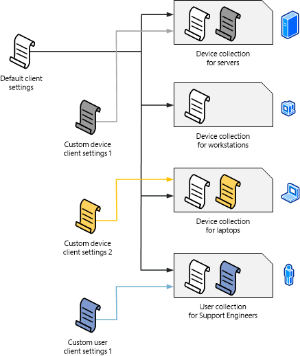

# 使用 System Center Configuration Manager 管理设备的基础知识
[!INCLUDE[cm6long](../LocTest/includes/cm6long_md.md)] 可管理两大类设备：

第一类是**客户端**，客户端是安装了 [!INCLUDE[cmshort](../LocTest/includes/cmshort_md.md)] 客户端软件以便你能够对其进行管理的一些设备，例如工作站、笔记本计算机、服务器和移动设备。   

第二类是**托管设备**，托管设备可包括客户端，但通常表示某些移动设备，这些移动设备没有安装 [!INCLUDE[cmshort](../LocTest/includes/cmshort_md.md)] 客户端软件并通过使用 [!INCLUDE[mit_first](../LocTest/includes/mit_first_md.md)] 或使用 [!INCLUDE[cmshort](../LocTest/includes/cmshort_md.md)] 的内置本地移动设备管理对其进行管理。

除了使用或不使用 [!INCLUDE[cmshort](../LocTest/includes/cmshort_md.md)] 客户端来管理设备外，还可以使用以用户为中心的管理来帮助分组以及标识所管理的设备。
  
## 使用 Configuration Manager 客户端管理设备 

 客户端的管理包括从设备收集硬件或软件的清单、在设备上安装新软件，以及定义特定配置的报告或强制符合性设置。 某些管理功能（例如硬件清单）需要设备运行 Configuration Manager 客户端软件。 所有托管设备都支持将软件安装（部署）到设备等其他操作。  
  
 若要使用 [!INCLUDE[cmshort](../LocTest/includes/cmshort_md.md)] 客户端软件管理设备，必须在你的网络上发现设备，然后将客户端软件部署（安装）到该设备，或者将客户端软件手动安装到一台新的计算机，然后在该计算机加入网络时让其加入你的站点。 若要发现尚未安装客户端软件的设备，请运行一个或多个内置的发现方法。 发现设备后，可以使用众多方法之一来安装客户端软件。 有关使用发现的信息，请参阅[运行 System Center Configuration Manager 发现](../LocTest/Run-discovery-for-System-Center-Configuration-Manager.md)。  
  
 发现支持运行 [!INCLUDE[cmshort](../LocTest/includes/cmshort_md.md)] 客户端软件的设备后，可以使用众多方法之一来安装软件。 安装软件并将客户端分配到主站点后，即可开始管理设备。  常见安装方法包括“客户端请求安装”、“基于软件更新的安装”、使用组策略、在计算机上手动安装，或者将客户端作为所部署操作系统映像的一部分。  
  
 安装客户端后，可以通过使用集合来简化管理设备的工作。 集合是所创建的设备或用户的逻辑分组，以便你可在共享一组公共条件的多个设备上执行管理任务。 例如，你可能希望在通过 [!INCLUDE[cmshort](../LocTest/includes/cmshort_md.md)] 注册的所有移动设备上安装移动设备应用程序。 如果是这种情况，你可以使用“所有移动设备”集合，该集合会自动排除计算机。 你可以依据业务需求创建自己的集合，以对你管理的设备进行逻辑分组。  
  
 有关详细信息，请参阅下列主题：  
  
-   [选择 System Center Configuration Manager 的设备管理解决方案](../LocTest/Choose-a-device-management-solution-for-System-Center-Configuration-Manager.md)  
  
-   [System Center Configuration Manager 中的客户端安装方法](../LocTest/Client-installation-methods-in-System-Center-Configuration-Manager.md)  
  
-   [System Center Configuration Manager 中的集合简介](../LocTest/Introduction-to-collections-in-System-Center-Configuration-Manager.md)  

### 客户端设置  
 在初次安装 [!INCLUDE[cmshort](../LocTest/includes/cmshort_md.md)] 时，将通过使用你可更改的默认客户端设置配置层次结构中的所有客户端。 这些客户端设置包括诸如以下配置选项：设备与站点通信的频率、是否为软件更新和其他管理操作启用客户端，或者用户是否能够将其移动设备注册为由 [!INCLUDE[cmshort](../LocTest/includes/cmshort_md.md)] 管理。  
  
 如果对于用户或设备组你需要不同的客户端设置，你可以创建自定义客户端设置，然后将这些设置分配给集合。  将集合中的成员配置为具有自定义设置，你可以创建多个自定义客户端设置，并根据你指定的顺序（按数值顺序）应用这些设置。  如果存在冲突的设置，则具有最低序号的设置优先于其他设置。  
  
 下图显示了你如何能创建和应用自定义客户端设置的示例。  
  
   
  
 若要了解有关客户端设置的详细信息，请参阅  
                [如何在 System Center Configuration Manager 中配置客户端设置](../LocTest/How-to-configure-client-settings-in-System-Center-Configuration-Manager.md)和[关于 System Center Configuration Manager 中的客户端设置](../LocTest/About-client-settings-in-System-Center-Configuration-Manager.md)。 
  
## 不使用 Configuration Manager 客户端而管理设备  
 [!INCLUDE[cmshort](../LocTest/includes/cmshort_md.md)] 与 [!INCLUDE[mit_first](../LocTest/includes/mit_first_md.md)] 协同工作，从而支持管理未安装客户端软件的设备和非托管设备。 有关详细信息，请参阅[在 System Center Configuration Manager 中使用本地基础结构管理移动设备](../LocTest/Manage-mobile-devices-with-on-premises-infrastructure-in-System-Center-Configuration-Manager.md)和[使用 System Center Configuration Manager 和 Exchange 管理移动设备](../LocTest/Manage-mobile-devices-with-System-Center-Configuration-Manager-and-Exchange.md)。  
  
## 以用户为中心的管理  
 除了设备集合外，还有一些用户集合，其中包含 Active Directory 域服务中的用户。 使用用户集合时，可以在集合的所有成员登录的计算机上安装软件，并配置“用户设备相关性”，以便仅在指定为用户主要设备的设备上安装所部署的软件。 这些主要设备称为主设备。 用户可以有一个或多个主设备。  
  
 用户可对其软件部署体验进行控制的一种方式是使用计算机客户端接口：**软件中心**。 软件中心自动安装在客户端计算机上，通过用户的“开始”菜单访问。 软件中心使用户能管理自己的软件，以及执行下列操作：  
  
-   安装软件  
  
-   将软件安排为在工作时间之外自动安装  
  
-   配置 [!INCLUDE[cmshort](../LocTest/includes/cmshort_md.md)] 可在其设备上安装软件的时间  
  
-   配置远程控制的访问权限设置（如果启用了远程控制） [!INCLUDE[cmshort](../LocTest/includes/cmshort_md.md)]  
  
-   配置电源管理的选项（如果管理用户启用了此项）  
  
 通过软件中心中的链接，用户可以连接到**应用程序目录**，在该目录中，用户可以浏览、安装和请求软件。 此外，应用程序目录使用户能够配置某些首选项设置、擦除其移动设备，并且（当你允许此项配置时）为用户设备相关性指定其主要设备。 \(配置用户设备相关性信息的其他方法包括从文件中导入信息，以及依据使用情况数据自动生成。\)  
  
 由于应用程序目录是 IIS 中承载的一个网站，因此用户还可以通过浏览器从 Intranet 或 Internet 中直接访问应用程序目录。  
  
 
  
## 另请参阅  
 [System Center Configuration Manager 基础知识](../LocTest/Fundamentals-of-System-Center-Configuration-Manager.md)