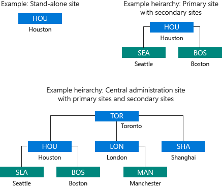

# System Center Configuration Manager 的站点和层次结构基础知识
[!INCLUDE[cm6long](../LocTest/includes/cm6long_md.md)] 部署必须安装在 Active Directory 域中，并具有一个或多个可形成站点层次结构的 Configuration Manager 站点的基础。 从单站点到多站点层次结构，安装的站点类型和位置在必要时提供扩展（扩大）部署的能力，并向托管用户和设备提供重要服务。 

## 站点的层次结构
首次安装 [!INCLUDE[cm6long](../LocTest/includes/cm6long_md.md)] 时，安装的第一个 [!INCLUDE[cmshort](../LocTest/includes/cmshort_md.md)] 站点将确定层次结构 \- 的作用域，你将以其为基础管理企业中的设备和用户。 此第一个站点必须为管理中心站点或独立主站点。  
  
 “管理中心站点”适合大规模部署，并能集中管理和灵活地支持分布在全局网络基础架构中的设备。 安装管理中心站点后，将需要安装一个或多个主站点作为子站点。  这是因为管理中心站点不直接支持设备管理（这是主站点的功能）。 管理中心站点支持多个子主站点，当托管设备处于不同地理位置时，可用这些子主站点直接管理设备和控制网络带宽。  
  
 “独立主站点”适合较小规模的部署，可用来管理设备而无需安装其他站点。 尽管独立主站点可以限制部署的大小，但它支持通过安装新的管理中心站点在稍后扩展层次结构的方案。 借助此站点扩展方案，独立主站点可成为子主站点，然后你便可以在你的新管理中心站点下安装其他子主站点。  这进而让你能够扩展初始部署以应对企业的未来增长。  
  
> [!TIP]  
>  独立主站点和子主站点实际上属于同一类型的站点：主站点。 名称差异基于某类层次结构关系，当你同时使用管理中心站点时会创建这一关系。  此层次结构关系还可能限制可扩展 [!INCLUDE[cmshort](../LocTest/includes/cmshort_md.md)] 功能的某些站点系统角色的安装。 这是因为某些站点系统角色只能安装在层次结构的顶层站点上，即管理中心站点或独立主站点上。  
  
 安装第一个站点后，即可安装其他站点。  如果第一个站点是管理中心站点，则可安装一个或多个子主站点。  安装主站点（独立主站点或子主站点）后，即可安装一个或多个辅助站点。  
  
 “辅助站点”只能作为子站点安装在主站点下。 此站点类型可对主站点进行扩展，使其可管理通过慢速网络连接到主站点的位置的设备。   即使辅助站点扩展主站点，客户端仍由主站点托管。 辅助站点通过对网络中发送（部署）到客户端的信息和客户端发送回站点的信息的传输进行压缩和管理，提供对远程位置设备的支持。  
  
 下图显示了一些示例站点设计。  
  
   
  
 有关详细信息，请参阅下列主题：  
  
-   [System Center Configuration Manager 简介](../LocTest/Introduction-to-System-Center-Configuration-Manager.md)  
  
-   [设计 System Center Configuration Manager 的站点层次结构](../LocTest/Design-a-hierarchy-of-sites-for-System-Center-Configuration-Manager.md)  
  
-   [安装 System Center Configuration Manager 站点](../Topic/Install%20System%20Center%20Configuration%20Manager%20sites.md)  
  
## 站点系统服务器和站点系统角色  
 每个 [!INCLUDE[cmshort](../LocTest/includes/cmshort_md.md)] 站点都将安装支持管理操作的“站点系统角色”。  安装站点时默认安装某些角色，如“站点服务器”角色（分配给你在其中安装站点的计算机）和站点数据库服务器角色（分配给托管站点数据库的 SQL Server）。 其他站点系统角色是可选的，仅在你希望使用站点系统角色允许使用的功能时使用。  托管站点系统角色的任何计算机都称为站点系统服务器。  
  
 对于 [!INCLUDE[cmshort](../LocTest/includes/cmshort_md.md)] 的较小部署，可在站点服务器计算机上直接初始运行所有站点系统角色。 然后，随着管理的环境规模的扩大以及需求的增长，你可以相应安装更多站点系统服务器来托管增加的站点系统角色，以改进站点向更多设备提供服务的效率。  
  
 有关不同的站点系统角色的信息，请参阅 [为 System Center Configuration Manager 规划站点系统服务器和站点系统角色](../LocTest/Plan-for-site-system-servers-and-site-system-roles-for-System-Center-Configuration-Manager.md)中的[站点系统角色](../LocTest/Plan-for-site-system-servers-and-site-system-roles-for-System-Center-Configuration-Manager.md#bkmk_planroles)  
  
## 将站点信息发布到 Active Directory 域服务  
 为简化 [!INCLUDE[cmshort](../LocTest/includes/cmshort_md.md)] 的管理，可将 Active Directory 架构扩展为支持 [!INCLUDE[cmshort](../LocTest/includes/cmshort_md.md)] 所使用的详细信息，然后让站点将其关键信息发布到 Active Directory 域服务 (AD DS)。 此操作将使你想管理的计算机能够从受信任的 AD DS 来源安全检索站点相关信息。 客户端可检索的信息将标识可用站点、站点系统服务器以及这些站点系统服务器提供的服务。  
  
 **扩展 Active Directory 架构**对于每个林只执行一次，且可在 [!INCLUDE[cmshort](../LocTest/includes/cmshort_md.md)] 安装前和安装后执行。   扩展架构时，必须在包含将发布供客户端查找的数据的 [!INCLUDE[cmshort](../LocTest/includes/cmshort_md.md)] 站点的每个域中创建一个名为 **System Management** 的新 Active Directory 容器。 有关详细信息，请参阅[扩展 System Center Configuration Manager 的 Active Directory 架构](../LocTest/Extend-the-Active-Directory-schema-for-System-Center-Configuration-Manager.md)。  
  
 **发布站点数据**可提高 [!INCLUDE[cmshort](../LocTest/includes/cmshort_md.md)] 层次结构的安全性并减少管理开销，但不是基本 [!INCLUDE[cmshort](../LocTest/includes/cmshort_md.md)] 功能所必需的。  
  
## 另请参阅  
 [System Center Configuration Manager 基础知识](../LocTest/Fundamentals-of-System-Center-Configuration-Manager.md)