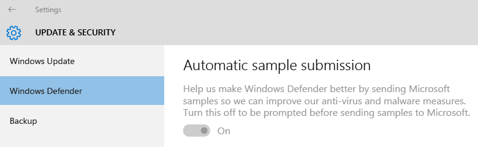

# 如何在 System Center Configuration Manager 中为 Endpoint Protection 创建和部署反恶意软件策略
你可以将反恶意软件策略部署到 [!INCLUDE[cm6long](../LocTest/includes/cm6long_md.md)] 客户端计算机的集合，以指定 [!INCLUDE[epshort](../LocTest/includes/epshort_md.md)] 如何保护它们免受恶意软件和其他威胁的侵害。 这些反恶意软件策略包括扫描计划、 文件和文件夹的扫描以及在检测到恶意软件时要执行的操作的类型有关的信息。 如果您启用 [!INCLUDE[epshort](../LocTest/includes/epshort_md.md)], ，默认值的反恶意软件策略应用到客户端计算机。 此外可以使用其他策略模板提供或创建您自己的自定义反恶意软件策略以满足您的环境的特定需求。  
  
> [!NOTE]  
>  [!INCLUDE[cmshort](../LocTest/includes/cmshort_md.md)] 提供的针对各种方案进行了优化并可以导入到的预定义模板选择 [!INCLUDE[cmshort](../LocTest/includes/cmshort_md.md)]。 这些模板在文件夹 *<ConfigMgr Install Folder\>*\AdminConsole\XMLStorage\EPTemplates 中提供。  
  
> [!IMPORTANT]  
>  如果创建新的反恶意软件策略并将其部署到集合时，此反恶意软件策略将替代默认反恶意软件策略。  
  
 使用本主题中的过程来创建或导入反恶意软件策略并将其分配给 [!INCLUDE[cm5short](../LocTest/includes/cm5short_md.md)] 层次结构中的客户端计算机。  
  
> [!NOTE]  
>  执行这些过程之前，请确保按照[在 System Center Configuration Manager 中配置 Endpoint Protection](../LocTest/Configuring-Endpoint-Protection-in-System-Center-Configuration-Manager.md) 中所述为 [!INCLUDE[epshort](../LocTest/includes/epshort_md.md)] 配置 [!INCLUDE[cmshort](../LocTest/includes/cmshort_md.md)]。  
  
##   若要修改默认反恶意软件策略  
  
1.  在 [!INCLUDE[cmshort](../LocTest/includes/cmshort_md.md)] 控制台中，单击 **资产和符合性**。  
  
2.  在 **资产和符合性** 工作区中，展开 **[!INCLUDE[epshort](../LocTest/includes/epshort_md.md)]**, ，然后单击 **反恶意软件策略**。  
  
3.  选择的反恶意软件策略 **默认客户端反恶意软件策略** ，然后在 **主页** 选项卡上，在 **属性** 组中，单击 **属性**。  
  
4.  在 **默认反恶意软件策略** 对话框框中，配置设置，您需要为此反恶意软件策略，然后单击 **确定**。  
  
    > [!NOTE]  
    >  如需可配置的设置列表，请参阅本主题中的 [List of Antimalware Policy Settings](../LocTest/How-to-create-and-deploy-antimalware-policies-for-Endpoint-Protection-in-System-Center-Configuration-Manager.md#BKMK_List) 。  
  
##   若要创建新的反恶意软件策略  
  
1.  在 [!INCLUDE[cmshort](../LocTest/includes/cmshort_md.md)] 控制台中，单击 **资产和符合性**。  
  
2.  在 **资产和符合性** 工作区中，展开 **[!INCLUDE[epshort](../LocTest/includes/epshort_md.md)]**, ，然后单击 **反恶意软件策略**。  
  
3.  在上 **主页** 选项卡上，在 **创建** 组中，单击 **创建反恶意软件策略**。  
  
4.  在 **常规** 部分 **创建反恶意软件策略** 对话框框中，输入名称和策略的描述。  
  
5.  在 **创建反恶意软件策略** 对话框框中，配置设置，您需要为此反恶意软件策略，然后单击 **确定**。  
  
    > [!NOTE]  
    >  如需可配置的设置列表，请参阅本主题中的 [List of Antimalware Policy Settings](../LocTest/How-to-create-and-deploy-antimalware-policies-for-Endpoint-Protection-in-System-Center-Configuration-Manager.md#BKMK_List) 。  
  
6.  验证新的反恶意软件策略是否显示在 **反恶意软件策略** 列表。  
  
##   若要导入反恶意软件策略  
  
1.  在 [!INCLUDE[cmshort](../LocTest/includes/cmshort_md.md)] 控制台中，单击 **资产和符合性**。  
  
2.  在 **资产和符合性** 工作区中，展开 **[!INCLUDE[epshort](../LocTest/includes/epshort_md.md)]**, ，然后单击 **反恶意软件策略**。  
  
3.  在 **主页** 选项卡上，在 **创建** 组中，单击 **导入**。  
  
4.  在 **打开** 对话框中，浏览到该策略文件以导入，然后单击 **打开**。  
  
5.  在 **创建反恶意软件策略** 对话框框中，查看设置以使用，然后单击 **确定**。  
  
6.  验证新的反恶意软件策略是否显示在 **反恶意软件策略** 列表。  
  
##   若要部署到客户端计算机的反恶意软件策略  
  
1.  在 [!INCLUDE[cmshort](../LocTest/includes/cmshort_md.md)] 控制台中，单击 **资产和符合性**。  
  
2.  在 **资产和符合性** 工作区中，展开 **[!INCLUDE[epshort](../LocTest/includes/epshort_md.md)]**, ，然后单击 **反恶意软件策略**。  
  
3.  在 **反恶意软件策略** 列表中，选择要部署的反恶意软件策略。 然后，在 **主页** 选项卡上，在 **部署** 组中，单击 **部署**。  
  
    > [!NOTE]  
    >  **部署** 选项不能与默认客户端恶意软件策略一起使用。  
  
4.  在 **选择集合** 对话框框中，选择您希望以部署反恶意软件策略，然后单击的设备集合 **确定**。  
  
##   反恶意软件策略设置的列表  
 许多反恶意软件设置都很容易理解。 配置它们之前，如需了解有关设置的更多详细信息，请参阅以下各部分。  
  
||  
|-|  
|[!INCLUDE[cm1602disclaimer](../LocTest/includes/cm1602disclaimer_md.md)]|  
  
### 计划扫描设置  
  
-   **扫描类型** - 你可以指定在客户端计算机上运行的两种扫描类型之一：  
  
    -   **快速扫描** – 此类型的扫描检查的内存中的进程和通常找到恶意软件的文件夹。 它要求更少的资源比完整扫描。  
  
    -   **完全扫描** – 这种扫描将所有本地文件和文件夹的完整检查添加到快速扫描在扫描的项。 此扫描时间超过一次快速扫描，并在客户端计算机上使用更多的 CPU 处理和内存资源。  
  
     在大多数情况下，使用 **快速扫描** 尽量减少客户端计算机上的系统资源的使用。 如果恶意软件删除需要完全扫描， [!INCLUDE[epshort](../LocTest/includes/epshort_md.md)] 会生成将显示在警报 [!INCLUDE[cmshort](../LocTest/includes/cmshort_md.md)] 控制台。 默认值是 **快速扫描**。  
  
-   **随机化计划的扫描开始时间（30 分钟内）** - 设置为“是”以帮助避免网络流量激增，如果所有计算机同时将其反恶意软件扫描结果发送至 [!INCLUDE[cmshort](../LocTest/includes/cmshort_md.md)] 数据库，就会出现这种情况。 此设置也很有用的一台主机上运行多个虚拟机时。 选择此选项可减少的反恶意软件扫描的同时进行磁盘访问量。  
  
### 扫描设置  
 **运行完全扫描时扫描网络驱动器** -  
                  设为“是”  可扫描客户端计算机上所有映射的网络驱动程序。 **注意：**如果启用此设置，可能会显著地增加客户端计算机上的扫描时间。  
  
 **在运行完全扫描时扫描映射的网络驱动器** - 从 Configuration Manager 1602 版开始，此设置可以提供更高的粒度，让管理员能够在按计划完全扫描的过程中允许按需扫描网络文件，从而规避始终扫描映射的网络驱动器的风险。 另请注意：  
  
-   必须将“扫描网络文件”设置设置为“是”，才可配置此设置。  
  
-   默认情况下，此设置为“否”，表示完全扫描将不访问映射的网络驱动器。  
  
### 默认操作设置  
 选择当在客户端计算机上检测到恶意软件时要执行的操作。 可以应用以下操作，具体取决于检测到恶意软件的警报的威胁级别。  
  
-   **推荐** – 使用恶意软件定义文件中建议的操作。  
  
-   **隔离** – 隔离恶意软件但不是删除它。  
  
-   **删除** – 从计算机中删除恶意软件。  
  
-   **允许** – 不删除或隔离恶意软件。  
  
### 实时保护设置  
  
|设置名|描述|  
|------------------|-----------------|  
|**启用实时保护**|设为“是”   可为客户端计算机配置实时保护设置。 我们建议你启用此设置。|  
|**监视计算机上的文件和程序活动**|如果希望 **监视文件和程序开始在客户端计算机上运行的时间，并提醒你这些文件和程序主动执行或被动接受的操作，请设置为“是”**[!INCLUDE[epshort](../LocTest/includes/epshort_md.md)] 。|  
|**扫描系统文件**|此设置允许你配置是否传入、 传出，或传入和传出的系统文件所监视的恶意软件。 出于性能原因，您可能需要更改的默认值 **扫描传入和传出文件** 如果服务器具有高的传入或传出文件的活动。|  
|**启用行为监视**|启用此设置以使用计算机的活动和文件数据来检测未知的威胁。 启用此设置后，它可能增加扫描恶意软件的计算机所需的时间。|  
|**启用针对基于网络的攻击的保护**|启用此设置以通过检查网络流量并阻止任何可疑的活动来保护计算机免受已知的网络攻击。|  
|**启用脚本扫描**|为 Configuration Manager 不带 service pack 仅。   如果希望扫描计算机上运行的任何脚本是否进行可疑的活动，请启用此设置。|  
|**在下载时和安装前阻止可能不需要的应用程序**|可能不需要的应用程序 (PUA) 是一种基于信誉和研究驱动的标识的威胁分类。 大多数情况下，它们是不需要的应用程序捆绑程序或其捆绑应用程序。   从 Configuration Manager 1602 版开始提供此保护策略设置，并将其默认设置为“是”。 启用后，此设置将在下载和安装时阻止 PUA。 但是，你可以排除特定文件或文件夹，以满足企业和组织的特定需求。|  
  
### 排除设置  
 **排除的文件和文件夹**：   
                  单击 **设置** 若要打开 **配置文件和文件夹排除** 对话框框中，并指定名称的文件和文件夹排除 [!INCLUDE[epshort](../LocTest/includes/epshort_md.md)] 扫描。  
  
 如果您想要排除文件和位于映射的网络驱动器的文件夹，每个文件夹的名称在网络驱动器中单独指定。 例如，如果某一网络驱动器映射为 F:\MyFolder，并且包含名为 Folder1、Folder2 和 Folder3 的子文件夹，请指定以下排除项：  
  
-   F:\MyFolder\Folder1  
  
-   F:\MyFolder\Folder2  
  
-   F:\MyFolder\Folder3  
  
 从 Configuration Manager 1602 版开始，Endpoint Protection 反恶意软件政策的“排除设置”部分中的现有“排除文件和文件夹”设置已改进为允许设备排除。 例如，你现在可以将以下内容指定为排除项：**\device\mvfs**（适用于 Multiversion 文件系统）。 策略不会验证设备路径；将 Endpoint Protection 策略提供给客户端上一定能解释该设备字符串的反恶意软件引擎。  
  
### 高级设置  
 **启用重新分析点扫描** - 如果希望 [!INCLUDE[epshort](../LocTest/includes/epshort_md.md)] 扫描 NTFS 重新分析点，请设置为“是”。  
                  有关重新分析点的详细信息，请参阅 [重新分析点](http://msdn.microsoft.com/library/windows/desktop/aa365503\(v=vs.85\).aspx) Windows 开发人员中心中。  
  
 从 Configuration Manager 1602 版开始，反恶意软件引擎可能会请求将文件示例发送到 Microsoft 供进一步分析。 默认情况下，发送此类示例之前将始终给出提示。 管理员现在可以管理以下设置以配置此行为：  
  
 **启用自动示例文件提交以帮助 Microsoft 确定某些检测到的项是否为恶意项** - 将此设置设为“是”以启用自动示例文件提交。 默认情况下，此设置为“否”，这意味着禁用了自动示例文件提交，并且将在发送示例前提示用户。   （此设置是在 System Center 2012 R2 Configuration Manager SP1 中首次推出的。）  
  
 **允许用户修改自动示例文件提交设置** - 此设置决定在设备上具有本地管理权限的用户可否在客户端界面中更改自动示例文件提交设置。 默认情况下，此设置为“否”，这意味着只能从 [!INCLUDE[cmconsole](../LocTest/includes/cmconsole_md.md)] 内更改设置，设备上的本地管理员不能更改此配置。  
    例如，下面显示了 Windows 10 中由管理员设置为启用的 Windows Defender 设置，并且不允许用户对其进行修改  
  
   
  
### 威胁替代设置  
 **威胁名称和替代操作** - 单击“设置”以自定义扫描中检测到威胁时应对每个威胁 ID 执行的修正操作。  
  
> [!NOTE]  
>  配置 [!INCLUDE[epshort](../LocTest/includes/epshort_md.md)]后，可能不会立即提供威胁名称列表。 请等待，直到 [!INCLUDE[epshort](../LocTest/includes/epshort_md.md)] 点是否同步威胁的信息，然后再试。  
  
### Microsoft Active Protection Services

启用 Microsoft Active Protection Service (MAPS) 可收集受管理虚拟机上检测到的恶意软件相关信息以及执行的操作。 此信息会发送给 Microsoft。 

**Microsoft Active Protection Service 成员资格：**
 
  - **基本** - 收集并发送检测到的恶意软件列表
  - **高级** - 基本信息以及更全面的信息（偶尔可能会包含个人信息），例如文件路径和部分内存转储
  
**允许用户修改 Microsoft Active Protection Service 设置** - 切换 MAPS 设置的用户控件

### 定义更新设置  
 **为 [!INCLUDE[epshort](../LocTest/includes/epshort_md.md)] 客户端更新设置源和顺序** - 单击“设置源”以指定用于定义和扫描引擎更新的源，同时指定它们的使用顺序。 如果将 [!INCLUDE[cmshort](../LocTest/includes/cmshort_md.md)] 指定为其中一个源，那么其他源仅在软件更新无法下载客户端更新时使用。  
  
 如果使用以下任何方法在客户端计算机上更新定义，那么客户端计算机必须能够访问 Internet。  
  
-   从 Microsoft 更新分发的更新  
  
-   从 Microsoft 恶意软件防护中心分发的更新  
  
> [!IMPORTANT]  
>  客户端通过使用内置系统帐户下载定义更新。 必须为此帐户配置代理服务器才能使这些客户端连接到 Internet。  
>   
>  如果已配置软件更新自动部署规则以将定义更新交付到客户端计算机，这些更新将被传送而不考虑定义更新设置。