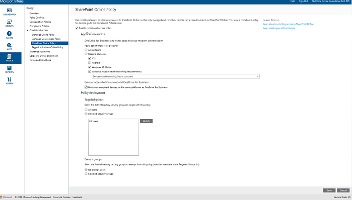

# 在 System Center Configuration Manager 中管理 SharePoint Online 访问
使用 [!INCLUDE[cm6long](../LocTest/includes/cm6long_md.md)] **SharePoint Online** 条件访问策略可基于指定的条件，管理对位于 SharePoint Online 上的 OneDrive for Business 文件的访问。  
  
> [!IMPORTANT]  
>  对具有使用新式验证的应用的电脑和 Windows 10 移动版设备进行的条件访问当前并非对所有 Intune 客户都可用。 如果已在使用这些功能，则无需执行任何操作。 可以继续使用它们。  
>   
>  如果尚未针对使用新式验证的应用为电脑或 Windows 10 移动版创建条件访问策略，则需要提交访问请求。 可以在[连接站点](http://go.microsoft.com/fwlink/?LinkId=761472)上了解有关已知问题以及如何才能访问此功能的详细信息。  
  
 当目标用户尝试在其设备上使用支持的应用（如 OneDrive）连接到文件时，会进行以下评估：  
  
   
  
 若要连接到所需文件，运行 OneDrive 的设备必须：  
  
-   已向 [!INCLUDE[mit_first](../LocTest/includes/mit_first_md.md)] 注册或是加入域的 PC。  
  
-   在 Azure Active Directory 中注册设备（向 [!INCLUDE[mit_next](../LocTest/includes/mit_next_md.md)]注册设备时会自动发生此情况）。  
  
     对于加入域的 PC，必须将它设置为向 Azure Active Directory [自动注册](https://azure.microsoft.com/en-us/documentation/articles/active-directory-conditional-access-automatic-device-registration/) 。  
  
-   符合任何已部署的 [!INCLUDE[cmshort](../LocTest/includes/cmshort_md.md)] 符合性策略  
  
 基于指定的条件，设备状态存储在可授予或阻止对文件的访问权限的 Azure Active Directory 中。  
  
 如果不满足条件，则用户将在登录时看到以下消息的其中一条：  
  
-   如果未向 [!INCLUDE[mit_next](../LocTest/includes/mit_next_md.md)]注册设备，或未在 Azure Active Directory 中注册，则会显示一条消息，说明有关如何安装公司门户应用和进行注册。  
  
-   如果设备不合规，则显示一条消息，将用户定向到 [!INCLUDE[mit_next](../LocTest/includes/mit_next_md.md)] Web 门户，用户可在该门户中找到有关相关问题及其修正方式的信息。  

- 对于移动设备：

  当使用 **iOS** 和 **Android** 设备的浏览器访问时，可以阻止对 SharePoint Online 的访问。  只允许在合规设备上使用受支持的浏览器进行访问：
* Safari (iOS)
* Chrome (Android)
* Managed Browser（iOS 和 Android）

  将阻止不受支持的浏览器。
-   对于 PC：  
  
    > [!IMPORTANT]  
    >  对电脑进行的条件访问当前并非对所有 Intune 客户都可用。 如果已对电脑使用条件访问，则无需执行任何操作。 可以继续使用它。  
    > 如果尚未为电脑创建条件访问策略，则需要提交访问请求。 可以在[连接站点](http://go.microsoft.com/fwlink/?LinkId=761472)上了解有关已知问题以及如何才能访问此功能的详细信息。  
  
    -   如果策略设置为要求加入域，而 PC 未加入域，则会显示一条与 IT 管理员联系的消息。  
  
    -   如果策略设置要求加入域或合规，而 PC 不符合任一要求，则会显示一条消息，其中包含有关如何安装公司门户应用和注册的说明。  
  
 你可以从以下应用阻止对 SharePoint Online 的访问：  
  
-   Microsoft Office Mobile (Android)  
  
-   Microsoft OneDrive（Android 和 iOS）  
  
-   Microsoft Word（Android 和 iOS）  
  
-   Microsoft Excel（Android 和 iOS）  
  
-   Microsoft PowerPoint（Android 和 iOS）  
  
-   Microsoft OneNote（Android 和 iOS）  
  
## 为 SharePoint Online 配置条件访问的步骤  
  
### 步骤 1：配置 Active Directory 安全组  
 在开始之前，针对条件访问策略配置 Azure Active Directory 安全组。 你可以在 **“Office 365 管理中心”**，或 **“Intune 帐户门户”**中配置这些组。 这些组包含将作为目标的用户，或从策略中免除的用户。 如果将某个用户设定为策略的目标，则其使用的每个设备必须合规才能访问资源。  
  
 你可以在 SharePoint Online 策略中指定两种组类型：  
  
-   **目标组** – 包含将应用策略的用户的组  
  
-   **免除组** – 包含从策略中免除的用户的组（可选）  
  
 如果用户位于两个组中，则会将其从策略中免除。  
  
### 步骤 2：配置和部署合规性策略  
 确保你创建合规性策略并将其部署到设定为 SharePoint Online 策略的目标的所有设备。  
  
> [!NOTE]  
>  将合规性策略部署到 [!INCLUDE[mit_next](../LocTest/includes/mit_next_md.md)] 组或 [!INCLUDE[cmshort](../LocTest/includes/cmshort_md.md)] 集合，而条件访问策略以 Azure Active Directory 安全组为目标。  
  
 有关如何配置合规性策略的详细信息，请参阅[管理 System Center Configuration Manager 中的设备合规性策略](../LocTest/Manage-device-compliance-policies-in-System-Center-Configuration-Manager.md)。  
  
> [!IMPORTANT]  
>  如果你尚未部署合规性策略，但是启用了 SharePoint Online 策略，则允许所有目标设备进行访问。  
  
 准备就绪后，继续 **步骤 3**。  
  
###   步骤 3：配置 SharePoint Online 策略  
 接下来，配置策略以要求只有托管及合规设备才能访问 SharePoint Online。 此策略会存储在 Azure Active Directory 中。  
  
1.  在 [!INCLUDE[cmshort](../LocTest/includes/cmshort_md.md)] 控制台中，单击“资产和符合性” 。  
  
2.  选择“启用 SharePoint Online 的条件访问策略” 。  
  
       
  
3.  在使用新式验证的 Outlook 和应用的“应用程序访问”下，可以选择将访问仅限为对每个平台合规的设备。  
  
    > [!TIP]  
    > “新式验证” **** 允许基于 Active Directory 身份验证库 (ADAL) 登录到 Office 客户端。  
    >   
    >  -   基于 ADAL 的身份验证使 Office 客户端能够实现基于浏览器的身份验证（也称为被动身份验证）。  为了进行身份验证，用户将被导向登录网页。  
    > -   这种全新的登录方法实现了新的方案，如基于“设备符合性”  以及“多重身份验证”  执行情况的条件访问。  
    >   
    >  有关新式身份验证工作原理的更多详细信息，请参阅本 [文章](https://support.office.com/en-US/article/How-modern-authentication-works-for-Office-2013-and-Office-2016-client-apps-e4c45989-4b1a-462e-a81b-2a13191cf517)。  
  
     对于 Windows PC，PC 必须加入域，或是向 [!INCLUDE[mit_next](../LocTest/includes/mit_next_md.md)] 注册并合规。 可以设置以下要求：  
  
    -   **设备必须已加入域或必须是合规的。** 这意味着 PC 必须已加入域或符合在 [!INCLUDE[mit_next](../LocTest/includes/mit_next_md.md)]。 如果 PC 不满足任一要求，则系统会提示用户向 [!INCLUDE[mit_next](../LocTest/includes/mit_next_md.md)]注册设备。  
  
    -   **设备必须已加入域。** 这意味着 PC 必须加入域才能访问 Exchange Online。 如果 PC 未加入域，则系统会阻止对电子邮件的访问，并且提示用户与 IT 管理员联系。  
  
    -   **设备必须是合规的。** 这意味着 PC 必须在 [!INCLUDE[mit_next](../LocTest/includes/mit_next_md.md)] 注册并合规。 如果 PC 未注册，则会显示一条消息，其中包含有关如何注册的说明。  

4.  在 SharePoint Online 和 OneDrive for Business 的“浏览器访问权限”中，你可以选择只允许通过受支持的浏览器访问 Exchange Online：Safari (iOS) 和 Chrome (Android)。 将阻止来自其他浏览器的访问。  你为 OneDrive 应用程序访问选择的平台限制在此处同样适用。

    在 **Android** 设备上，用户必须启用浏览器访问。  若要执行此操作，最终用户必须在注册的设备上启用"启用浏览器访问"选项，如下所示：
    1.  启动“公司门户应用”。
    2.  从三个点 (…) 或硬件菜单按钮转到“设置”页。
    3.  按“启用浏览器访问”按钮。
    4.  在 Chrome 浏览器中注销 Office 365 并重新启动 Chrome。

    在 **iOS 和 Android** 平台上，为了识别用于访问服务的设备，Azure Active Directory 将向该设备颁发一个传输层安全性 (TLS) 证书。  该设备在显示证书时会出现提示，让最终用户选择证书，如以下屏幕截图所示。 最终用户必须选择此证书后，才能继续使用该浏览器。

     **iOS**

     

     **Android**

      
  
4.  在“主页”  选项卡的“链接”  组，单击“在 Intune 控制台中配置条件性访问策略” 。 你可能需要提供用于连接 [!INCLUDE[cmshort](../LocTest/includes/cmshort_md.md)] 和 [!INCLUDE[mit_next](../LocTest/includes/mit_next_md.md)]的帐户的用户名和密码。  
  
     随即将打开 [!INCLUDE[mit_next](../LocTest/includes/mit_next_md.md)] 管理控制台。  
  
5.  在 [Microsoft Intune 管理控制台](https://manage.microsoft.com)中，单击“策略” > “条件访问” > “SharePoint Online 策略”。  
  
6.  选择 **如果该设备不符合要求，阻止应用访问 SharePoint Online**。  
  
7.  在“目标组” 下，单击“修改”  以选择将应用策略的 Azure Active Directory 安全组。  
  
8.  在“免除组” 下，可以选择“修改”  以选择从此策略中免除的 Azure Active Directory 安全组。  
  
9. 完成后，请单击“保存” 。  
  
 不需要部署条件访问策略，它将立即生效。  
  
 请参阅[使用 Microsoft Intune 管理 SharePoint Online 访问](https://technet.microsoft.com/library/dn705844.aspx) 以获取关于如何监视来自 [!INCLUDE[mit_next](../LocTest/includes/mit_next_md.md)] 控制台的策略的信息。  
  
## 另请参阅  
 [在 System Center Configuration Manager 中管理对服务的访问](../LocTest/Manage-access-to-services-in-System-Center-Configuration-Manager.md)