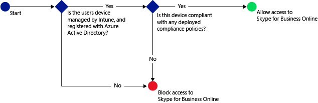
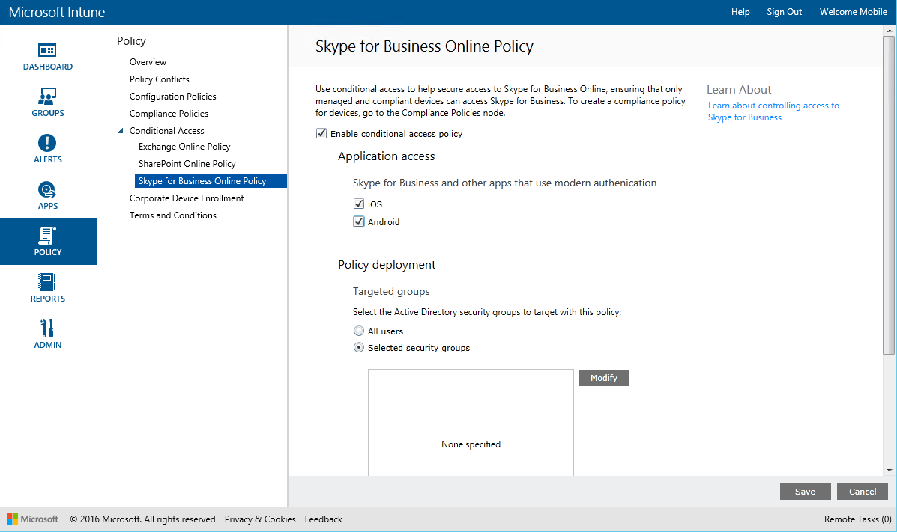

# 管理 Skype for Business Online 访问
基于你指定的条件，使用 **Skype for Business Online** 的条件访问策略管理对 Skype for Business Online 的访问权限。  
  
  
 当目标用户尝试在其设备上使用 Skype for Business Online 时，将评估以下方面：  
  
## 先决条件  
  
-   为 Skype for Business Online 启用新式验证。 填充该[连接窗体](https://connect.microsoft.com/office/Survey/NominationSurvey.aspx?SurveyID=17299&ProgramID=8715)以在新式验证程序中注册。  
  
-   所有最终用户都必须使用 Skype for Business Online。 如果你的部署中同时具有 Skype for Business Online 和本地 Skype for Business，则条件访问策略不会应用于最终用户。  
  
-   需要访问 Skype for Business Online 的设备必须：  
  
    -   是 Android 或 iOS 设备。  
  
    -   向 Intune 注册。  
  
    -   符合任何已部署的 Intune 合规性策略。  
  
 基于指定的条件，设备状态存储在可授予或阻止访问的 Azure Active Directory 中。  
如果不满足条件，则用户将在登录时看到以下消息的其中一条：  
  
-   如果设备未向 Intune 注册，或未在 Azure Active Directory 中注册，则会显示一条消息，说明如何安装公司门户应用并进行注册。  
  
-   如果设备不合规，则会显示一条消息，将用户定向到 Intune 公司门户网站或公司门户应用，用户可在其中找到有关该问题及其修正方式的信息。  
  
## 为 Skype for Business Online 配置条件访问  
  
### 步骤 1：配置 Active Directory 安全组  
 在开始之前，针对条件访问策略配置 Azure Active Directory 安全组。 你可以在 Office 365 管理中心中配置这些组。 这些组包含将作为目标的用户，或从策略中免除的用户。 如果将某个用户设定为策略的目标，则其使用的每个设备必须合规才能访问资源。  
  
 你可以指定两种组类型以用于 Skype for Business 策略：  
  
-   目标组 – 包含将应用策略的用户组  
  
-   免除组 - 包含从策略中免除的用户的组（可选）\)  
    如果用户位于两个组中，则会将其从策略中免除。  
  
### 步骤 2：配置和部署合规性策略  
 确保创建合规性策略并将其部署到设定为 Skype for Business Online 策略目标的所有设备。  
  
 有关如何配置合规性策略的详细信息，请参阅[管理 System Center Configuration Manager 中的设备合规性策略](../LocTest/Manage-device-compliance-policies-in-System-Center-Configuration-Manager.md)。  
  
> [!NOTE]  
>  如果你尚未部署合规性策略，但是启用了 Skype for Business Online 策略，则允许所有已向 Intune 注册的目标设备进行访问。  
  
 准备就绪后，继续执行步骤 3。  
  
### 步骤 3：配置 Skype for Business Online 策略  
 接下来，配置策略以要求只有托管及合规的设备才能访问 Skype for Business Online。 此策略会存储在 Azure Active Directory 中。  
  
1.  在 [Microsoft Intune 管理控制台](https://manage.microsoft.com)中，单击“策略”\>“条件访问”\>“Skype for Business Online 策略”。  
  
       
  
2.  选择“启用条件访问策略”。  
  
3.  在“应用程序访问”下，可以选择将条件访问策略应用到：  
  
    -   iOS  
  
    -   Android  
  
4.  在“目标组” 下，单击“修改”  以选择将应用策略的 Azure Active Directory 安全组。 你可以选择将其应用于所有用户或仅针对特定用户组。  
  
5.  在“免除组” 下，可以选择“修改”  以选择从此策略中免除的 Azure Active Directory 安全组。  
  
6.  完成后，请单击“保存” 。  
  
 现在为 Skype for Business Online 配置了条件访问。 不需要部署条件访问策略，它将立即生效。  
  
## 监视遵从性和条件性访问策略  
 在“组”工作区中，可以查看设备的条件访问状态。  
  
 选择任何移动设备组，然后在“设备”选项卡上，选择以下“筛选器”之一：  
  
-   **未向 AAD 注册的设备** - 阻止这些设备访问 Skype for Business Online。  
  
-   **不合规的设备** - 阻止这些设备访问 Skype for Business Online。  
  
-   **已向 AAD 注册的合规设备** - 这些设备可以访问 Skype for Business Online。  
  
## 另请参阅  
 [在 System Center Configuration Manager 中管理设备合规性策略](../LocTest/Manage-device-compliance-policies-in-System-Center-Configuration-Manager.md)