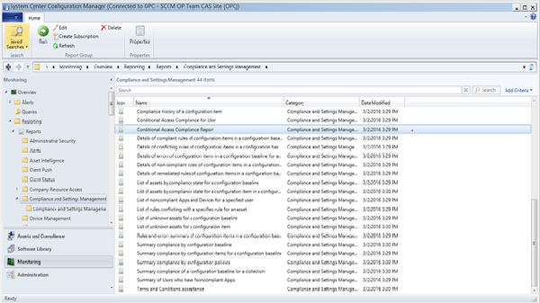

# 管理对由 System Center Configuration Manager 管理的电脑的 O365 服务的访问
||  
|-|  
|[!INCLUDE[cm1602disclaimer](../LocTest/includes/cm1602disclaimer_md.md)]|  
  
 **从 Configuration Manager 的版本 1602 开始**，可以为 System Center Configuration Manager 管理的电脑配置条件访问。  
  
> [!IMPORTANT]  
>  这是预发行功能。 预发行功能包含在产品中，用于在生产环境中进行早期测试，但不应将其视为生产就绪。  
  
 如果你在查找有关如何为 Intune 注册和管理的设备或是已加入域但是没有评估其合规性的电脑配置条件访问，请参阅[管理在 System Center Configuration Manager 中的访问服务](../LocTest/Manage-access-to-services-in-System-Center-Configuration-Manager.md)。  
  
> [!IMPORTANT]  
>  对具有使用新式验证的应用的电脑和 Windows 10 移动版设备进行的条件访问当前并非对所有 **Intune** 户都可用。 如果已在 **Intune** 使用这些功能，则无需执行任何操作。 可以继续使用它们。  
>   
>  **这不适用于电脑或 Windows 10 移动版设备对 Exchange 内部部署进行条件访问。**  
>   
>  如果尚未针对使用新式验证的应用为电脑或 Windows 10 移动版创建条件访问策略，则需要提交访问请求。 可以在[连接站点](http://go.microsoft.com/fwlink/?LinkId=761472)上了解有关已知问题以及如何才能访问此功能的详细信息。  
  
## 支持的服务  
  
-   Exchange Online  
  
-   SharePoint Online  
  
## 支持的电脑  
  
-   Windows 7  
  
-   Windows 8.1  
  
-   尚不完全支持 Windows 10。  如果你尝试设置为对 Windows 10 电脑进行的条件访问，则可能会遇到一些问题。  有关更多详细信息，请参阅[已知问题](#bkmk_KnownIssues)。  
  
## 配置条件访问  
 若要设置条件访问，必须先创建合规性策略并配置条件访问策略。 为电脑配置条件访问策略时，可以要求电脑符合合规性策略，以便能够访问 Exchange Online 和 SharePoint Online 服务。  
  
### 先决条件  
  
-   ADFS 同步和 O365 订阅。 O365 订阅用于设置 Exchange Online 和 SharePoint Online。  
  
-   Microsoft Intune 订阅。 应在 Configuration Manager 控制台中配置 Microsoft Intune 订阅。 这仍然需要你采用混合部署。  
  
 电脑必须满足以下要求：  
  
-   将设备自动注册到 Azure Active Directory 所要满足的[先决条件](https://azure.microsoft.com/en-us/documentation/articles/active-directory-conditional-access-automatic-device-registration/?rnd=1)  
  
     可以通过合规性策略向 Azure AD 注册电脑。  
  
    -   对于 Windows 8.1 和 Windows 10 电脑，你可以使用 Active Directory 组策略将设备配置为自动注册到 Azure AD。  
  
    -   对于 Windows 7 电脑，必须通过 System Center Configuration Manager 将设备注册软件包部署到 Windows 7 电脑。 [将已加入 Windows 域的设备自动注册到 Azure Active Directory](https://azure.microsoft.com/en-us/documentation/articles/active-directory-conditional-access-automatic-device-registration/?rnd=1) 主题包含更多详细信息。  
  
-   必须使用[启用了](https://support.office.com/en-US/article/Using-Office-365-modern-authentication-with-Office-clients-776c0036-66fd-41cb-8928-5495c0f9168a)新式验证的 Office 2013 或 Office 2016。  
  
 下面介绍的步骤适用于 Exchange Online 和 SharePoint Online  
  
### 步骤 1。 配置合规性策略  
 在 Configuration Manager 控制台中，使用以下规则创建合规性策略：  
  
-   需要在 Azure Active Directory 中注册：此规则检查用户的设备是否在加入到 Azure AD 的地方运行，如果不是，则在 Azure AD 中自动注册该设备。 仅 Windows 8.1 支持自动注册。 对于 Windows 7 PC，请部署 MSI 来执行自动注册。 有关更多详细信息，请参阅[将设备自动注册到 Azure Active Directory](https://azure.microsoft.com/en-us/documentation/articles/active-directory-conditional-access-automatic-device-registration/?rnd=1)  
  
-   **在晚于特定天数的截止日期之前安装所有必需的更新：**此规则检查用户的设备是否在截止日期及你指定的宽限期内具有所需的所有更新（在所需的自动更新规则中指定），并自动安装任何挂起的所需更新。  
  
-   **需要使用 BitLocker 驱动器加密功能：**此规则检查设备的主驱动器（例如 C:\）是否使用 BitLocker 进行了加密。 如果主驱动器上未启用 Bitlocker 加密，则将阻止设备对电子邮件和 SharePoint 服务的访问。  
  
-   **需要反恶意软件：**此规则检查是否已启用并正在运行反恶意软件（仅限 System Center Endpoint Protection 或 Windows Defender）。 如果未启用，则将阻止对电子邮件和 SharePoint 服务的访问。  
  
### 步骤 2。 评估条件访问的影响  
 运行条件访问符合性报表。 可以在“报表”\>“符合性和设置管理”下的“监视”部分中找到它。 这会显示所有设备的符合性状态。  会阻止报告为不符合的设备访问 Exchange Online 和 SharePoint Online。  
  
   
  
### 配置 Active Directory 安全组  
 根据策略类型将条件访问策略的目标设定为用户组。 这些组包含将作为目标的用户，或从策略中免除的用户。 如果将某个用户设定为策略的目标，则其使用的每个设备必须合规才能访问服务。  
  
 Active Directory 安全用户组 这些用户组应同步到 Azure Active Directory。 你还可以在 Office 365 管理中心或 Intune 帐户门户中配置这些组。  
  
 你可以在每个策略中指定两种组类型：  
  
-   **目标组** - 策略应用到的用户组  
  
-   **免除组** - 从策略中免除的用户组（可选）\)  
    如果用户位于两个组中，则会将其从策略中免除。  
  
     仅会评估设定为条件访问策略的目标的组。  
  
### 步骤 3。  为 Exchange Online 和 SharePoint Online 创建条件访问策略  
  
1.  在 Configuration Manager 控制台中，单击“资产和符合性” 。  
  
2.  若要为 Exchange Online 创建策略，请选择“启用 Exchange Online 的条件访问策略”。  
  
     若要为 SharePoint Online 创建策略，请选择“启用 Exchange Online 的条件访问策略”。  
  
3.  在“主页”  选项卡的“链接”  组，单击“在 Intune 控制台中配置条件性访问策略” 。 你可能需要提供用于连接 Configuration Manager 和 Intune 的帐户的用户名和密码。  
  
     随即将打开 Intune 管理控制台。  
  
4.  对于 Exchange Online，在 Microsoft Intune 管理控制台中，单击“策略”\>“条件访问”\>“Exchange Online 策略”。  
  
     对于 SharePoint Online，在 Microsoft Intune 管理控制台中，单击“策略”\>“条件访问”\>“SharePoint Online 策略”。  
  
5.  将 Windows 电脑要求设置为**设备必须是合规的选项**。  
  
6.  在“目标组” 下，单击“修改”  以选择将应用策略的 Azure Active Directory 安全组。  
  
    > [!NOTE]  
    >  应用条件访问策略的用户组还应该应用合规性策略。  
  
     在“免除组” 下，可以选择“修改”  以选择从此策略中免除的 Azure Active Directory 安全组。  
  
7.  单击“保存”以创建和保存策略  
  
 因不合规而被阻止的最终用户将在 System Center Configuration Manager 软件中心查看合规性信息，并且在纠正合规性问题之后启动新的策略评估。  
  
##   已知问题  
 使用此功能时，可能会遇到以下问题：  
  
-   在此 1602 更新中，不强制执行 5 天合规性。 即使最终用户设备上的合规性检查发生在 5 天以前，用户仍然可以访问 Office 365 和 SharePoint Online。  
  
-   设备不符合合规性策略时，不会自动显示原因。 最终用户必须转到新的软件中心才能查找不符合的原因。 原因显示在软件中心的设备合规性部分中。  
  
-   尝试访问 O365 和\/或 SharePoint Online 资源时，Windows 10 用户可能会遇到多次访问失败。 请注意，对于 Windows 10，不完全支持条件访问。  
  
> [!IMPORTANT]  
>  对电脑进行的条件访问当前并非对所有 Intune 客户都可用。 如果已对具有 **Intune**的电脑使用条件访问，则无需执行任何操作。 可以继续使用它。  
> 如果尚未为电脑创建条件访问策略，则需要提交访问请求。 可以在[连接站点](http://go.microsoft.com/fwlink/?LinkId=761472)上了解有关已知问题以及如何才能访问此功能的详细信息。  
  
## 另请参阅  
 [使用 System Center Configuration Manager 保护数据和站点基础架构](../LocTest/Protect-data-and-site-infrastructure-with-System-Center-Configuration-Manager.md)