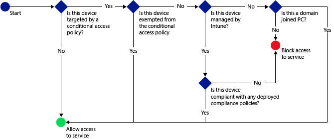

# 在 System Center Configuration Manager 中管理对服务的访问
根据你指定的条件，使用 **的** 条件访问 [!INCLUDE[cm6long](../LocTest/includes/cm6long_md.md)] 来保护在 [!INCLUDE[mit_first](../LocTest/includes/mit_first_md.md)]中注册的设备的电子邮件和其他服务。  
  
 有关使用 System Center Configuration Manager 进行管理并评估其合规性的电脑上的条件访问的信息，请参阅 [Manage access to O365 services for PCs managed by System Center Configuration Manager](../LocTest/Manage-access-to-O365-services-for-PCs-managed-by-System-Center-Configuration-Manager.md)（管理对由 System Center Configuration Manager 管理的电脑的 O365 服务的访问权限）。  
  
> [!IMPORTANT]  
>  对具有使用新式验证的应用的电脑和 Windows 10 移动版设备进行的条件访问当前并非对所有 Intune 客户都可用。 如果已在使用这些功能，则无需执行任何操作。 可以继续使用它们。  
>   
>  **这不适用于电脑或 Windows 10 移动版设备对 Exchange 内部部署进行条件访问。**  
>   
>  如果尚未针对使用新式验证的应用为电脑或 Windows 10 移动版创建条件访问策略，则需要提交访问请求。 可以在[连接站点](http://go.microsoft.com/fwlink/?LinkId=761472)上了解有关已知问题以及如何才能访问此功能的详细信息。  
  
 条件性访问的典型流可能如下所示：  
  
   
  
 使用条件性访问管理对以下服务的访问：  
  
-   Microsoft Exchange 内部部署  
  
-   Microsoft Exchange Online  
  
-   Exchange Online Dedicated  
  
-   SharePoint Online  
  
-   Skype for Business Online 

-   Dynamics CRM Online 
  
 你可以从以下平台上的内置电子邮件客户端控制对 Exchange Online 和 Exchange 内部部署的访问：  
  
-   Android 4.0 及更高版本、Samsung Knox 标准版 4.0 及更高版本  
  
-   iOS 7.1 及更高版本  
  
-   Windows Phone 8.1 及更高版本  
  
-   Windows 8.1 和更高版本上的邮件应用程序  
  
 你可以从所列平台的以下应用中控制对 SharePoint Online 的访问：  
  
-   Microsoft Office Mobile (Android)  
  
-   Microsoft OneDrive（Android 和 iOS）  
  
-   Microsoft Word（Android 和 iOS）  
  
-   Microsoft Excel（Android 和 iOS）  
  
-   Microsoft PowerPoint（Android 和 iOS）  
  
-   Microsoft OneNote（Android 和 iOS）  
  
 Office 桌面应用程序可以访问运行以下系统的 PC 上的 Exchange Online 和 SharePoint Online：  
  
-   已启用 [新式身份验证](https://support.office.com/en-US/article/Using-Office-365-modern-authentication-with-Office-clients-776c0036-66fd-41cb-8928-5495c0f9168a) 的 Office 桌面 2013及更高版本。  
  
-   Windows 7.0 或 Windows 8.1  
  
> [!NOTE]  
>  PC 应已加入域或符合 [!INCLUDE[mit_next](../LocTest/includes/mit_next_md.md)]中设置的策略。  
  
 若要实现条件性访问，你可以在 [!INCLUDE[cmshort](../LocTest/includes/cmshort_md.md)]中配置两个策略类型：  
  
-   “符合性策略” 是可选策略，你可以将其部署到用户集合并对设置进行评估，例如：  
  
    -   密码  
  
    -   加密  
  
    -   设备是否已越狱或取得 root 权限  
  
    -   设备上的电子邮件是由 [!INCLUDE[cmshort](../LocTest/includes/cmshort_md.md)] 还是 [!INCLUDE[mit_next](../LocTest/includes/mit_next_md.md)] 策略进行管理  
  
     如果没有将合规性策略部署到设备，那么任何适用的条件性访问策略都会将该设备视为合规。  
  
-   “条件性访问策略” 针对特定服务而配置，并定义相应规则，如哪些 Azure Active Directory 安全用户组或 [!INCLUDE[cmshort](../LocTest/includes/cmshort_md.md)] 用户集合将被设为目标或豁免。  
  
     可从 [!INCLUDE[cmshort](../LocTest/includes/cmshort_md.md)] 控制台配置本地 Exchange 条件性访问策略。 但是，当配置 Exchange Online 或 SharePoint Online 策略时，将打开 [!INCLUDE[mit_next](../LocTest/includes/mit_next_md.md)] 管理控制台用于配置策略。  
  
     与其他 [!INCLUDE[mit_next](../LocTest/includes/mit_next_md.md)] 或 [!INCLUDE[cmshort](../LocTest/includes/cmshort_md.md)] 策略不同，你无需部署条件访问策略。 相反，你只需配置这些策略一次，它们将应用于所有目标用户。  
  
 当设备不满足你配置的条件时，将指导用户完成注册设备并修复阻止设备合规的问题的流程。  
  
## 开始之前  
 在你开始使用条件性访问之前，请确保已经满足正确的要求：  
  
|策略类型|惠?|  
|-----------------|------------------|  
|Exchange Online（使用共享多租户环境）|条件访问 Exchange Online 支持运行以下操作系统的设备：   -   Windows 8.1 及更高版本（若已注册到 [!INCLUDE[mit_next](../LocTest/includes/mit_next_md.md)]） -   Windows 7.0 或 Windows 8.1（若已加入域） -   Windows Phone 8.1 及更高版本 -   iOS 7.1 及更高版本 -   Android 4.0 及更高版本、Samsung Knox 标准版 4.0 及更高版本   此外：   -   设备必须加入工作区，工作区可将设备注册到 Azure Active Directory Device Registration 服务 (AAD DRS)。      已加入域的 PC 必须通过组策略或 MSI 自动注册到 Azure Active Directory。 本主题中的“PC 的条件性访问”  描述了启用 PC 的条件性访问的所有要求。      AAD DRS 将对 Intune 和 Office 365 客户自动激活。 已经部署了 ADFS 设备注册服务的用户将不会在他们本地的 Active Directory 上看到已注册的设备。 -   必须使用包含 Exchange Online（例如 E3）的 Office 365 订阅，并且用户必须获得 Exchange Online 许可。 -   **Exchange Server 连接器**是可选的，它可将 [!INCLUDE[cmshort](../LocTest/includes/cmshort_md.md)] 连接到 Microsoft Exchange Online 并且有助于你通过 [!INCLUDE[cmshort](../LocTest/includes/cmshort_md.md)] 控制台监视设备信息（请参阅[使用 System Center Configuration Manager 和 Exchange 管理移动设备](../LocTest/Manage-mobile-devices-with-System-Center-Configuration-Manager-and-Exchange.md)）。 你不需要使用连接器来使用合规性策略或条件性访问策略，但要求你运行帮助评估条件性访问影响的报告。|  
|Exchange Online Dedicated|Exchange Online Dedicated 的条件性访问支持运行以下操作系统的设备：   -   Windows 8 及更高版本（若已注册到 [!INCLUDE[mit_next](../LocTest/includes/mit_next_md.md)]） -   Windows 7.0 或 Windows 8.1（若已加入域）      已加入域的 PC 的条件性访问仅针对新 Exchange Online 专用环境中的租户。 -   Windows Phone 8 及更高版本 -   使用 Exchange ActiveSync (EAS) 电子邮件客户端的任何 iOS 设备 -   Android 4 及更高版本 -   对于旧 Exchange Online Dedicated 环境中的租户：      你必须使用“Exchange Server 连接器”   ，它将 [!INCLUDE[cmshort](../LocTest/includes/cmshort_md.md)] 连接到 Microsoft Exchange 内部部署。 由此你可以管理移动设备并启用条件访问（请参阅[使用 System Center Configuration Manager 和 Exchange 管理移动设备](../LocTest/Manage-mobile-devices-with-System-Center-Configuration-Manager-and-Exchange.md)）。 -   对于新 Exchange Online Dedicated 环境中的租户：      可选 Exchange Server 连接器**将 [!INCLUDE[cmshort](../LocTest/includes/cmshort_md.md)] 连接到 Microsoft Exchange Online 并且有助于你管理设备信息（请参阅[使用 System Center Configuration Manager 和 Exchange 管理移动设备](../LocTest/Manage-mobile-devices-with-System-Center-Configuration-Manager-and-Exchange.md)）。 你不需要使用连接器来使用合规性策略或条件性访问策略，但要求你运行帮助评估条件性访问影响的报告。|  
|Exchange 内部部署|Exchange 内部部署支持的条件性访问：   -   Windows 8 及更高版本（若已注册到 [!INCLUDE[mit_next](../LocTest/includes/mit_next_md.md)]） -   Windows Phone 8 及更高版本 -   iOS 上的本机电子邮件应用 -   Android 4 或更高版本上的本机电子邮件应用 -   不支持 Microsoft Outlook 应用（Android 和 iOS）。   此外：   <ul><li>你的 Exchange 版本必须是 Exchange 2010 或更高版本。 支持 Exchange Server 客户端访问服务器 (CAS) 阵列。 **提示：**      如果你的 Exchange 环境在 CAS 服务器配置中，则必须将本地 Exchange 连接器配置为指向一个 CAS 服务器。</li><li>你必须使用“Exchange Server 连接器”  ，它将 [!INCLUDE[cmshort](../LocTest/includes/cmshort_md.md)] 连接到 Microsoft Exchange 内部部署。 由此你可以管理移动设备并启用条件访问（请参阅[使用 System Center Configuration Manager 和 Exchange 管理移动设备](../LocTest/Manage-mobile-devices-with-System-Center-Configuration-Manager-and-Exchange.md)）。   <ul><li>请确保使用最新版本的 **内部部署 Exchange 连接器**。 应通过 Configuration Manager 控制台来配置本地 Exchange 连接器。 有关详细的演练，请参阅[使用 System Center Configuration Manager 和 Exchange 管理移动设备](../LocTest/Manage-mobile-devices-with-System-Center-Configuration-Manager-and-Exchange.md)。</li><li>连接器仅可在 System Center Configuration Manager 主站点上进行配置。</li><li>此连接器支持 Exchange CAS 环境。          在配置连接器时，必须对其进行设置，以便与一个 Exchange CAS 服务器通信。</li></ul></li><li>可以基于身份验证或用户凭据条目使用证书来配置 Exchange ActiveSync</li></ul>|  
|Skype for Business Online|条件访问至 SharePoint Online 支持运行以下操作系统的设备：   -   iOS 7.1 及更高版本 -   Android 4.0 及更高版本 -   Samsung Knox 标准版 4.0 或更高版本   此外，你必须为 Skype for Business Online 启用新式验证。 填充该[连接窗体](https://connect.microsoft.com/office/Survey/NominationSurvey.aspx?SurveyID=17299&ProgramID=8715)以在新式验证程序中注册。 所有最终用户都必须使用 Skype for Business Online。 如果你的部署同时具有 Skype for Business Online 和本地 Skype for Business，则条件访问策略不会应用于处于本地部署中的最终用户。|  
|SharePoint Online|条件访问至 SharePoint Online 支持运行以下操作系统的设备：   -   Windows 8.1 及更高版本（若已注册到 [!INCLUDE[mit_next](../LocTest/includes/mit_next_md.md)]） -   Windows 7.0 或 Windows 8.1（若已加入域） -   Windows Phone 8.1 及更高版本 -   iOS 7.1 及更高版本 -   Android 4.0 及更高版本、Samsung Knox 标准版 4.0 及更高版本   此外：   -   设备必须加入工作区，工作区可将设备注册到 Azure Active Directory Device Registration 服务 (AAD DRS)。      已加入域的 PC 必须通过组策略或 MSI 自动注册到 Azure Active Directory。 本主题中的“PC 的条件性访问”  描述了启用 PC 的条件性访问的所有要求。      AAD DRS 将对 Intune 和 Office 365 客户自动激活。 已经部署了 ADFS 设备注册服务的用户将不会在他们本地的 Active Directory 上看到已注册的设备。 -   SharePoint Online 订阅是必需的，并且用户必须获得 SharePoint Online 许可。|  
|PC 的条件性访问|你可以设置 PC 的条件性访问以访问满足以下要求的 PC 的“Exchange Online”  和“SharePoint Online”  ，其中该 PC 运行 Office 桌面应用程序：   -   电脑必须可以运行 Windows 7.0 或 Windows 8.1。 -   PC 必须已加入域或必须合规。      为了符合规范，PC 必须在 [!INCLUDE[mit_next](../LocTest/includes/mit_next_md.md)] 中进行注册且符合相应策略。      对于加入域的电脑，必须将它设置为 [自动向 Azure Active Directory 注册设备](https://azure.microsoft.com/en-us/documentation/articles/active-directory-conditional-access-automatic-device-registration/) 。 -   [Office 365 新式验证必须已启用](https://blogs.office.com/2015/03/23/office-2013-modern-authentication-public-preview-announced/)，且具有所有最新的 Office 更新。      新式验证将基于 Active Directory 身份验证库 (ADAL) 的登录引入到 Office 2013 Windows 客户端中，并实现诸如“多重身份验证” 和“基于证书的身份验证” 等更佳的安全性。 -   安装 ADFS 声明规则以阻止非新式验证协议。|  
  
## 后续步骤  
 阅读以下主题，了解如何为你要求的方案配置合规性策略和条件性访问策略：  
  
-   [在 System Center Configuration Manager 中管理设备合规性策略](../LocTest/Manage-device-compliance-policies-in-System-Center-Configuration-Manager.md)  
  
-   [在 System Center Configuration Manager 中管理对电子邮件的访问](../LocTest/Manage-email-access-in-System-Center-Configuration-Manager.md)  
  
-   [在 System Center Configuration Manager 中管理 SharePoint Online 访问](../LocTest/Manage-SharePoint-Online-access-in-System-Center-Configuration-Manager.md)  
  
-   [管理 Skype for Business Online 访问](../LocTest/Manage-Skype-for-Business-Online-access.md)  
  
## 另请参阅  
 [System Center Configuration Manager 中的符合性设置入门](../LocTest/Get-started-with-compliance-settings-in-System-Center-Configuration-Manager.md)