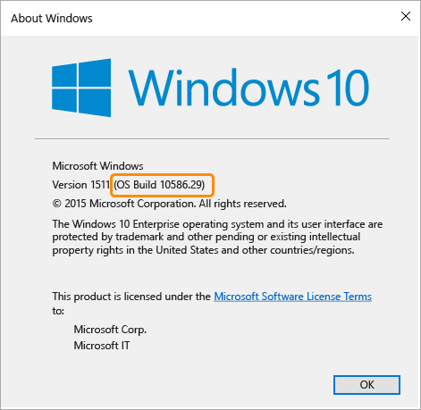

# 在 System Center Configuration Manager 中管理设备合规性策略
**中的** 合规性策略 [!INCLUDE[cm6long](../LocTest/includes/cm6long_md.md)] 定义设备必须遵从的规则和设置，以便将设备视为符合条件访问策略。 也可使用符合性策略来监视和修正独立于条件访问的设备符合性问题。  
  
||  
|-|  
|[!INCLUDE[cm1602disclaimer](../LocTest/includes/cm1602disclaimer_md.md)]|  
  
> [!IMPORTANT]  
>  本文介绍了由 [!INCLUDE[mit_first](../LocTest/includes/mit_first_md.md)] 管理的设备的合规性策略。    由 System Center Configuration Manager 管理的电脑的合规性策略在[管理对由 System Center Configuration Manager 管理的电脑的 O365 服务的访问](../LocTest/Manage-access-to-O365-services-for-PCs-managed-by-System-Center-Configuration-Manager.md)中进行了说明。  
  
 这些规则包括：  
  
-   PIN 和密码  
  
-   加密  
  
-   设备是否已越狱或取得 root 权限  
  
-   设备上的电子邮件是否由 [!INCLUDE[mit_next](../LocTest/includes/mit_next_md.md)] 策略管理，或者设备是否被 Windows 设备运行状况证明服务报告为不正常。  
  
-   所需的最低操作系统版本 - 这通常取决于你公司的合规性策略和安全要求。 这有助于防止访问可能因使用较旧的操作系统版本而具有安全漏洞的设备。  
  
-   允许的最高操作系统版本 - 你可以选择不支持在测试之前或因其他原因提供的最新操作系统版本。 你可以选择阻止版本高于你所指定版本的设备。   该设备不能访问公司资源，直至策略变更。  
  
> [!NOTE]  
>  在 Windows PC 上，Windows 操作系统版本 8.1 被报告为 6.3 而非 8.1。    对于 Windows，如果操作系统版本规则设置为 Windows 8.1，则该设备将报告为不符合要求，即使该设备具有 Windows 操作系统 8.1 也是如此。 确保针对最低和最高操作系统规则设置正确的 Windows“报告”  版本。 版本号必须与 winver 命令返回的版本一致。 Windows Phone 不具有此问题，版本按预期报告为 8.1。  
>   
>  使用 Windows 10 操作系统的 Windows PC 的版本应设置为 "10.0"+ winver 命令返回的 OS 内部版本号。 例如，可以为与 10.0.10586 类似的版本号。  
> Windows 10 Mobile 没有这样的问题。  
>   
>    
  
 将符合性策略部署到用户集合。 将合规性策略部署到用户后，会对所有用户设备检查合规性。  
  
 下表列出了合规性策略支持的设备类型，也列出了当该策略与条件访问策略一起使用时托管不符合合规性的设置的方式。  
  
|规则|Windows 8.1 及更高版本|Windows Phone 8.1 及更高版本|iOS 6.0 及更高版本|Android 4.0 及更高版本|Samsung KNOX 标准版 4.0 和更高版本|  
|----------|---------------------------|---------------------------------|-----------------------|---------------------------|-----------------------------------------|  
|PIN 或密码配置|已修正|已修正|已修正|已隔离|已隔离|  
|设备加密|不适用|已修正|已修正（通过设置 PIN）|已隔离|已隔离|  
|已越狱或取得 root 权限的设备|不适用|不适用|已隔离（非设置）|已隔离（非设置）|已隔离（非设置）|  
|电子邮件配置文件|不适用|不适用|已隔离|不适用|不适用|  
|最低操作系统版本|已隔离|已隔离|已隔离|已隔离|已隔离|  
|最高操作系统版本|已隔离|已隔离|已隔离|已隔离|已隔离|  
|设备运行状况证明（1602 更新）|设置不适用于 Windows 8.1   Windows 10 和 Windows 10 移动版已隔离。|不适用|不适用|不适用|不适用|  
  
 **修正** = 法规遵从性由设备操作系统强制执行（例如，强制用户设置 PIN）。  设置永远不会不符合要求。  
  
 **已隔离** = 设备操作系统并不强制合规性（例如，Android 设备不强制用户加密设备）。  这种情况下：  
  
-   如果条件访问策略将用户作为目标，则会阻止设备。  
  
-   公司门户或 Web 门户将通知用户任何合规性问题。  
  
##   步骤 1：创建符合性策略  
  
1.  在 [!INCLUDE[cmshort](../LocTest/includes/cmshort_md.md)] 控制台中，单击“资产和符合性” 。  
  
2.  在“资产和符合性”  工作区中，展开“符合性设置” ，然后单击“符合性策略” 。  
  
3.  在“主页”  选项卡上的“创建”  组中，单击“创建符合性策略” 。  
  
4.  在“创建符合性策略向导”  的“常规” 页上，指定下列信息：  
  
    |设置|更多信息|  
    |-------------|----------------------|  
    |**Name**|输入合规性策略的唯一名称。 最多可以使用 256 个字符。|  
    |**描述**|输入对 VPN 配置文件进行概述以及可帮助在 [!INCLUDE[cmshort](../LocTest/includes/cmshort_md.md)] 控制台中对其进行识别的描述。 最多可以使用 256 个字符。|  
    |**合规性策略的类型**|**从 Configuration Manager 的 1602 版开始**，可根据设备是否由 Configuration Manager 管理来选择你想创建的策略类型。   对于由 Intune 管理的设备，请选择“适用于不由 Configuration Manager 客户端管理的设备的合规性策略”选项。  选择此选项时，还可选择你希望将此策略应用到的平台类型。|  
    |**报表的不符合性严重程度**|指定此合规性策略被评估为不符合时报告的严重性级别。 可用的严重性级别如下：   -**不报告** - 对于 [!INCLUDE[cmshort](../LocTest/includes/cmshort_md.md)] 报表，不符合此符合性规则的设备不报告故障严重性。   -                             **信息** - 对于[!INCLUDE[cmshort](../LocTest/includes/cmshort_md.md)] 报表，不符合此符合性规则的设备将报告“信息”的故障严重性。   -                             **警告** - 对于 [!INCLUDE[cmshort](../LocTest/includes/cmshort_md.md)] 报表，不符合此符合性规则的设备将报告“警告”的故障严重性。   -                             **严重** - 对于 [!INCLUDE[cmshort](../LocTest/includes/cmshort_md.md)] 报表，不符合此符合性规则的设备将报告“严重”的故障严重性。   -                             **事件严重** - 对于 [!INCLUDE[cmshort](../LocTest/includes/cmshort_md.md)] 报表，不符合此符合性规则的设备将报告“严重”的故障严重性。 应用程序事件日志中也会以 Windows 事件的形式记录此严重性级别。|  
  
5.  在“受支持的平台”  页上，选择将在其上评估符合性策略的设备平台，或者单击“选择全部”  以选择所有设备平台。  
  
6.  在“规则”  页上，定义一个或多个规则，这些规则定义设备为评估为合规而必需具有的配置。 下表显示可用的规则。 当创建符合性策略时，会默认启用某些规则，但你可以编辑或删除这些规则。  
  
    |规则名称|更多信息|Windows Phone 8+|Windows RT/8.1|Windows 8.1|Windows 10/Windows 10 移动版|iOS 6+|Android 4.0+|Samsung KNOX 标准版 4.0+|  
    |---------------|----------------------|-----------------------|---------------------|-----------------|-----------------------------------|-------------|-------------------|---------------------------------|  
    |**移动设备上需要密码设置**|要求用户输入密码后才能访问其设备。   （默认情况下启用）|✓||||✓|✓|✓|  
    |“需要密码才能解锁空闲设备”（1602 更新）|要求用户输入密码才能访问已锁定的设备。|✓||||✓|✓|✓|  
    |“需要提供密码之前处于非活动状态的分钟数”（1602 更新）|指定用户必须重新输入密码前的空闲时间。   请将此值设置为以下可用选项之一：1 分钟、5 分钟，15 分钟，30 分钟，1 小时。   此规则必须与“需要密码才能解锁空闲设备”一起使用。 此处设置的值决定设备何时被视为空闲和锁定状态，并且“需要密码才能解锁空闲设备”设置为“True”时，需要用户输入密码才能访问已锁定的设备。|✓|✓|||✓|✓|✓|  
    |“需要自动更新”（1602 更新）|可以要求运行 Windows 8.1 或更高版本的设备自动安装更新，并指定更新的类别。   值应设置为“无”以防止自动安装，设置为“推荐”将自动安装所有推荐的更新，或设置为“重要”以只安装归类为重要的更新。|✓|||||||  
    |**允许简单密码**|用户可以创建简单密码，如“**1234**”或“**1111**”。   （默认情况下禁用）|✓||||✓|||  
    |**最短密码长度** 1|指定用户密码必须包含的最小位数或最小字符数。   （默认值为**6** ）|✓||✓||✓|✓|✓|  
    |**移动设备上的文件加密**|要求设备进行加密以连接到资源。   运行 Windows Phone 8 的设备进行自动加密。   当配置设置“移动设备上需要密码设置” 时，将对运行 iOS 的设备进行加密。   （默认情况下启用）|✓||✓|||✓|✓|  
    |**设备不能已越狱或取得 root 权限**|如果启用，已越狱 (iOS) 或取得 root 权限的 (Android) 设备将不会符合。   （默认情况下禁用）|||||✓|✓|✓|  
    |**必须由 Intune 管理电子邮件配置文件**|将此选项设置为“是”时，设备必须使用部署到该设备的电子邮件配置文件。   如果电子邮件配置文件未部署到相同的用户组（符合性策略将此用户组作为目标），则设备不合规。   如果用户已在设备上设置了电子邮件帐户，且该帐户与部署到该设备的 Intune 电子邮件配置文件相匹配，则该设备同样不合规。 这种情况下，Intune 不能覆盖用户设置的配置文件，因此无法管理它。 用户可以通过删除现有的电子邮件设置（它允许 Intune 安装托管的电子邮件配置文件）将该设备变为合规。   有关电子邮件配置文件的详细信息，请参阅 [使用 Microsoft Intune 启用对使用电子邮件配置文件的公司电子邮件的访问](https://technet.microsoft.com/en-US/library/dn800672.aspx)。   （默认情况下禁用）|||||✓|||  
    |**电子邮件配置文件**|如果“必须由 Intune 管理电子邮件帐户”  处于选中状态，单击“选择”  以选择设备必须由其管理的电子邮件配置文件。 电子邮件配置文件必须存在于设备上。|||||✓|||  
    |**所需的最低操作系统**|当设备不满足最低操作系统版本要求时，它将被报告为不符合要求。 将显示一个链接，链接中包含有关如何升级的信息。 最终用户可以选择升级其设备，升级后他们将可以访问公司资源。|✓||✓||✓|✓|✓|  
    |**允许的最高操作系统版本**|当设备使用的操作系统版本高于规则中指定的版本时，将阻止访问公司资源，并要求用户联系其 IT 管理员。 除非变更规则以允许该操作系统版本，否则该设备将不能用于访问公司资源。|✓||✓||✓|✓|✓|  
    |“要求设备被报告为正常”（1602 更新）|可以在新的或现有的合规性策略中设置规则，要求 Windows 10 设备必须被报告为正常。 如果启用了此设置，运行状况证明服务 (HAS) 会对 Windows 10 设备的下列数据点进行评估：   - **已启用 BitLocker**   如果打开了 Bitlocker，则当系统关闭或进入休眠状态时，设备能够保护存储在驱动器上的数据免受未经授权的访问。  Windows BitLocker 驱动器加密可以对存储在 Windows 操作系统卷上的所有数据进行加密。 BitLocker 使用 TPM 来帮助保护 Windows 操作系统和用户数据，它还有助于确保计算机不被篡改，即使计算机处于无人参与、丢失或被盗的状态。 如果计算机装有兼容的 TPM，BitLocker 将使用该 TPM 锁定用于保护数据的加密密钥。 因此，仅当 TPM 验证计算机的状态后才能访问密钥。   **- 已启用代码完整性**   代码完整性是这样一项功能，它在每次将驱动器或系统文件加载到内存时行验证其完整性。 代码完整性会检测是否将未签名的驱动器或系统文件加载到内核，或者系统文件是否被具有管理员权限的用户帐户所运行的恶意软件修改。   **- 已启用安全启动**   启用安全启动后，会将系统强制启动为工厂信任的状态。 并且启用安全启动后，用于启动计算机的核心组件必须具有制造设备的组织所信任的正确的加密签名。 UEFI 固件将在对此进行验证后才允许计算机启动。 如果有任何文件被篡改，破坏了其签名，则系统将不会启动。   **- 已启用开机初期启动的反恶意软件（此设置仅适用于电脑。）**   开机初期启动的反恶意软件 (ELAM) 在网络中的计算机启动后、第三方驱动程序初始化之前，对计算机提供保护。 默认关闭此规则。   有关 HAS 服务工作原理的详细信息，请参阅[运行状况证明 CSP](https://msdn.microsoft.com/library/dn934876.aspx)。||||✓||||  
  
     1 对于运行 Windows 和配备 Microsoft 帐户的设备，合规性策略将无法正确评估 **最短密码长度** 是否超过 8 个字符或者 **最小字符集数** 是否大于 2。  
  
7.  在向导的“摘要”  页上，查看已作出的设置，然后完成向导。  
  
 新的策略将在  “资产和符合性”工作区的  “符合性策略”节点处显示。  
  
## 部署合规性策略  
  
1.  在 [!INCLUDE[cmshort](../LocTest/includes/cmshort_md.md)] 控制台中，单击“资产和符合性” 。  
  
2.  在“资产和符合性”  工作区中，展开“符合性设置” ，然后单击“符合性策略” 。  
  
3.  在“主页”  选项卡上的“部署”  组中，单击“部署” 。  
  
4.  在“部署符合性策略”  对话框中，单击  “浏览”以选择要将策略部署到的用户集合。  
  
     此外，当策略不合规时可以选择选项以生成警报，还可配置将按其评估策略符合性的计划。  
  
5.  完成后，请单击“确定” 。  
  
## 监视合规性策略  
  
#### 在 Configuration Manager 控制台查看符合性结果  
  
1.  在 [!INCLUDE[cmshort](../LocTest/includes/cmshort_md.md)] 控制台中，单击“监视” 。  
  
2.  在“监视”  工作区中，单击“部署” 。  
  
3.  在“部署”  列表中，选择要查看其符合性信息的符合性策略部署。  
  
4.  你可以在主页上查看有关策略部署符合性的摘要信息。 若要查看更详细的信息，请选择部署，然后在“主页”  选项卡上的“部署”  组中，单击“查看状态”  以打开“部署状态”  页。  
  
     “部署状态”  页包含下列选项卡：  
  
    -   “符合性”：显示基于受影响资产数量的策略符合性。 你可以单击规则以在“资产和符合性”  工作区中的“用户”  或“设备”  节点下创建一个临时节点，其中包含符合此规则的所有用户或设备。 “资产详细信息”  窗格显示符合策略的用户或设备。 双击列表中的用户或设备以显示其他信息。  
  
    -   “错误”：显示基于受影响资产数量的所选策略部署的所有错误的列表。 你可以单击规则以在  “资产和符合性”  工作区的“用户”或“设备”  节点下创建一个临时节点，其中包含对于此规则生成了错误的所有用户或设备。 当你选择某个用户或设备时，“资产详细信息”  窗格将显示受所选问题影响的用户或设备。 双击列表中的用户或设备以显示有关问题的其他信息。  
  
    -   “不符合性”：显示基于受影响资产数量的策略内所有不符合规则的列表。 你可以单击规则以在“资产和符合性”  工作区的“用户”  或“设备”  节点下创建一个临时节点，其中包含不符合此规则的所有用户或设备。 当你选择某个用户或设备时，“资产详细信息”  窗格将显示受所选问题影响的用户或设备。 双击列表中的用户或设备以显示有关问题的进一步信息。  
  
    -   “未知”：显示没有为所选策略部署报告符合性的所有用户和设备的列表，以及设备的当前客户端状态。  
  
#### 查看运行状况证明报告  
  
1.  **从 Configuration Manager 的 1602 版开始**，在 [!INCLUDE[cmshort](../LocTest/includes/cmshort_md.md)] 控制台中，单击“监视”。  
  
2.  若要按合规性状态查看设备当前状态的摘要报告，请单击“安全”。 然后单击“运行状况证明”。  
  
3.  若要查看列出了所有设备和所有运行状况证明属性的报告，请单击“安全”。 然后单击“运行状况证明”。  
  
## 后续步骤  
 现在可将合规性策略与条件访问策略一起使用，以便控制对组织中服务的访问。  
  
## 另请参阅  
 [在 System Center Configuration Manager 中管理对服务的访问](../LocTest/Manage-access-to-services-in-System-Center-Configuration-Manager.md)