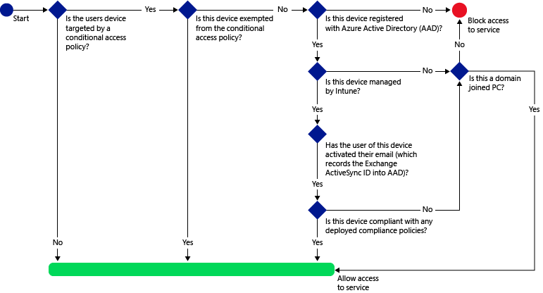
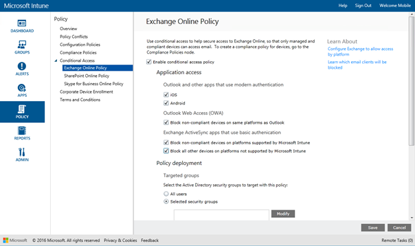
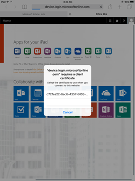
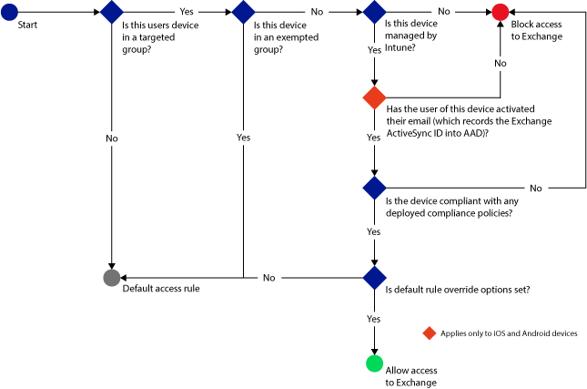
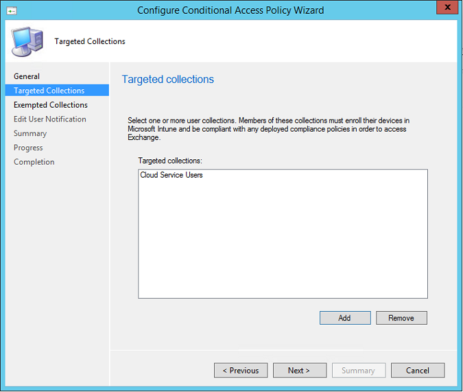
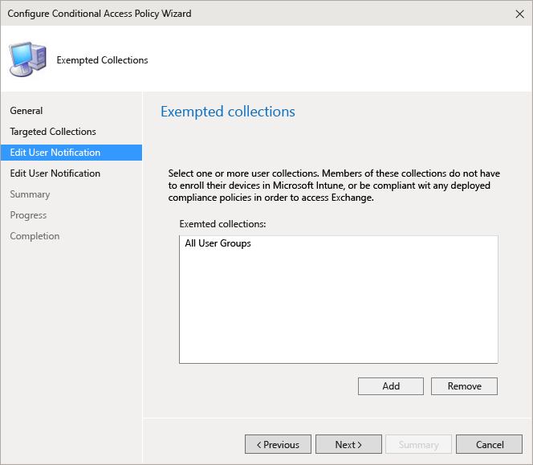
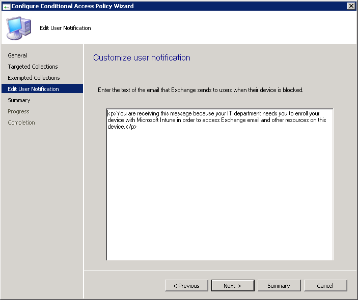

# 在 System Center Configuration Manager 中管理对电子邮件的访问
根据你指定的条件，使用 [!INCLUDE[cm6long](../LocTest/includes/cm6long_md.md)] 条件访问来管理对 Exchange 电子邮件的访问。  
  
||  
|-|  
|[!INCLUDE[cm1602disclaimer](../LocTest/includes/cm1602disclaimer_md.md)]|  
  
 你可以管理对以下内容的访问权限：  
  
-   Microsoft Exchange 内部部署  
  
-   Microsoft Exchange Online  
  
-   Exchange Online Dedicated  
  
> [!IMPORTANT]  
>  对具有使用新式验证的应用的电脑和 Windows 10 移动版设备进行的条件访问当前并非对所有 Intune 客户都可用。 如果已在使用这些功能，则无需执行任何操作。 可以继续使用它们。  
>   
>  **这不适用于电脑或 Windows 10 移动版设备对 Exchange 内部部署进行条件访问。**  
>   
>  如果尚未针对使用新式验证的应用为电脑或 Windows 10 移动版创建条件访问策略，则需要提交访问请求。 可以在[连接站点](http://go.microsoft.com/fwlink/?LinkId=761472)上了解有关已知问题以及如何才能访问此功能的详细信息。  
  
 如果在用户可以连接到其电子邮件之前配置条件访问，那么他们使用的设备必须：  
  
-   已在 [!INCLUDE[mit_next](../LocTest/includes/mit_next_md.md)] 中注册或者是加入域的 PC。  
  
-   在 Azure Active Directory 中注册设备（在 [!INCLUDE[mit_next](../LocTest/includes/mit_next_md.md)] 中注册设备时会自动发生此情况（仅限 Exchange Online））。 此外，必须已向 Azure Active Directory 注册客户端 Exchange ActiveSync ID（不适用于连接到 Exchange 内部部署的 Windows 和 Windows Phone 设备）。  
  
     对于加入域的 PC，必须将它设置为自动向 Azure Active Directory 注册。  [在 System Center Configuration Manager 中管理对服务的访问](../LocTest/Manage-access-to-services-in-System-Center-Configuration-Manager.md)主题中的**针对 PC 的条件性访问**部分列出了为 PC 启用条件性访问的完整要求集。  
  
-   符合任何部署到该设备的 [!INCLUDE[cmshort](../LocTest/includes/cmshort_md.md)] 符合性策略  
  
 如果不满足某个条件性访问条件，则用户会在登录时看到以下消息的其中一条：  
  
-   如果未在 [!INCLUDE[mit_next](../LocTest/includes/mit_next_md.md)]中注册设备，或未在 Azure Active Directory 中注册，则显示一条消息，说明如何安装公司门户应用和注册设备，对于 Android 和 iOS 设备，还将说明如何激活电子邮件（这可将设备的 Exchange ActiveSync ID 与 Azure Active Directory 中的设备记录相关联）。  
  
-   如果设备不合规，则显示一条消息，将用户定向到 [!INCLUDE[mit_next](../LocTest/includes/mit_next_md.md)] web 门户，用户可在该门户中找到有关问题及其解决方式的信息。  

**对于移动设备：**

当使用 **iOS** 和 **Android** 设备的浏览器访问时，可以阻止对 Exchange Online 上的 **Outlook Web Access (OWA)** 的访问。  只允许在合规设备上使用受支持的浏览器进行访问：

* Safari (iOS)
* Chrome (Android)
* Managed Browser（iOS 和 Android）

将阻止不支持的浏览器。不支持适用于 iOS 和 Android 的 OWA 应用程序。  将通过 ADFS 声明规则对其进行阻止：
* 安装 ADFS 声明规则以阻止非新式验证协议。 方案 3 中提供了详细说明 - [阻止除基于浏览器的应用程序之外的所有其他应用程序访问 O365](https://technet.microsoft.com/library/dn592182.aspx)。
 
 **对于 PC：**  
  
-   如果条件访问策略要求是允许“已加入域”  或“合规” ，则会显示一条消息，其中包含有关如何注册设备的说明。 如果 PC 不满足任一要求，则系统会要求用户在 [!INCLUDE[mit_next](../LocTest/includes/mit_next_md.md)]中注册设备。  
  
-   如果条件访问策略要求设置为只允许加入域的 Windows 设备，则会阻止设备并显示一条与 IT 管理员联系的消息。  
  
 在以下平台上，你可以从设备内置 Exchange ActiveSync 电子邮件客户端阻止对 Exchange 电子邮件的访问：  
  
-   Android 4.0 及更高版本、Samsung Knox 标准版 4.0 及更高版本  
  
-   iOS 7.1 及更高版本  
  
-   Windows Phone 8.1 及更高版本  
  
-   Windows 8.1 及更高版本上的 **“邮件”** 应用程序  
  
 Exchange Online 仅支持适用于 iOS 和 Android 的 Outlook 应用以及 Outlook 桌面 2013 和更高版本。  
  
 运行条件性访问需要 **和 Exchange 之间的** 本地 Exchange Connector [!INCLUDE[cmshort](../LocTest/includes/cmshort_md.md)] 。  
  
 你可从 [!INCLUDE[cmshort](../LocTest/includes/cmshort_md.md)] 控制台为 Exchange 内部部署配置条件性访问策略。 为 Exchange Online 配置条件访问策略时，你可以在 [!INCLUDE[cmshort](../LocTest/includes/cmshort_md.md)] 控制台中开始此过程，此时将启动 [!INCLUDE[mit_next](../LocTest/includes/mit_next_md.md)] 控制台，你可在其中完成该过程。  
  
## 步骤 1：评估条件访问策略的影响  
 在配置 **和 Exchange 之间的**之后，你可以使用 [!INCLUDE[cmshort](../LocTest/includes/cmshort_md.md)]**按条件访问状态的设备列表** 报表确定在配置了条件访问策略后要阻止访问 Exchange 的设备。 此报表还要求：  
  
-   订阅 [!INCLUDE[mit_next](../LocTest/includes/mit_next_md.md)]  
  
-   应配置和部署服务连接点  
  
 在报表参数中，选择你想要评估的 [!INCLUDE[mit_next](../LocTest/includes/mit_next_md.md)] 组，并根据需要选择策略将应用到的设备平台。  
  
 有关如何运行报表的详细信息，请参阅 [System Center Configuration Manager 中的报表](../LocTest/Reporting-in-System-Center-Configuration-Manager.md)。  
  
 运行报表后，检查以下四列以确定是否将阻止用户：  
  
-   **管理通道** – 指示设备是否由 Intune 和/或 Exchange ActiveSync 进行管理。  
  
-   **已向 AAD 注册** – 指示是否已向 Azure Active Directory 注册设备（称为“工作区加入”）。  
  
-   **合规** – 指示设备是否符合部署的任何合规性策略。  
  
-   **已激活 EAS** – iOS 和 Android 设备需要具有与 Azure Active Directory 中的设备注册记录相关联的 Exchange ActiveSync ID。 当用户单击隔离电子邮件中的“激活电子邮件”  链接时，将发生这种情况。  
  
    > [!NOTE]  
    >  Windows Phone 设备始终在此列中显示一个值。  
  
 对于属于目标组或集合的设备，将阻止其访问 Exchange，除非列值与下表中列出的值匹配：  
  
|管理通道|已向 ADD 注册|合规|已激活 EAS|产生的操作|  
|------------------------|--------------------|---------------|-------------------|----------------------|  
|**由 Microsoft Intune 和 Exchange ActiveSync 管理**|是|是|显示“是” 或“否” |允许电子邮件访问|  
|任何其他值|否|否|不显示任何值|阻止电子邮件访问|  
  
 你可以导出报表的内容，并使用 **“电子邮件地址”** 列来帮助你通知用户他们将被阻止。  
  
## 步骤 2：为条件性访问策略配置用户组或集合  
 将条件性访问策略的目标设定为不同的用户组或集合，具体取决于策略类型。 这些组包含将作为目标的用户，或从策略中免除的用户。 如果将某个用户设定为策略的目标，则其使用的每个设备必须合规才能访问电子邮件。  
  
-   **对于 Exchange Online 策略** – 目标设定为 Azure Active Directory 安全用户组。 你可以在 **“Office 365 管理中心”**，或 **“Intune 帐户门户”**中配置这些组。  
  
-   **对于 Exchange 內部部署策略** – 目标设定为 [!INCLUDE[cmshort](../LocTest/includes/cmshort_md.md)] 用户集合。 你可以在“资产和符合性”  工作区中进行配置。  
  
 你可以在每个策略中指定两种组类型：  
  
-   **目标组** – 策略应用到的用户组或集合  
  
-   **免除组** – 从策略中免除的用户组或集合（可选）  
  
 如果用户位于两个组中，则会将其从策略中免除。  
  
 仅会对条件性访问策略面向的组或集合评估 Exchange 访问权限。  
  
## 步骤 3：配置和部署符合性策略  
 确保你已创建合规性策略并将其部署到设定为 Exchange 条件访问策略的目标的所有设备。  
  
 有关如何配置合规性策略的详细信息，请参阅[管理 System Center Configuration Manager 中的设备合规性策略](../LocTest/Manage-device-compliance-policies-in-System-Center-Configuration-Manager.md)。  
  
> [!IMPORTANT]  
>  如果你尚未部署合规性策略，但是启用了 Exchange 条件访问策略，则将允许设定为目标的所有设备进行访问。  
  
 准备就绪后，继续 **步骤 4**。  
  
## 步骤 4：配置条件访问策略  
  
### 对于 Exchange Online（和新 Exchange Online Dedicated 环境中的租户）  
 Exchange Online 的条件访问策略使用下面的流来评估是允许还是阻止设备。  
  
   
  
 若要访问电子邮件，设备必须：  
  
-   注册到 [!INCLUDE[mit_next](../LocTest/includes/mit_next_md.md)]  
  
-   PC 必须已加入域或已注册，并且符合在 [!INCLUDE[mit_next](../LocTest/includes/mit_next_md.md)]中设置的策略。  
  
-   在 Azure Active Directory 中注册设备（向 [!INCLUDE[mit_next](../LocTest/includes/mit_next_md.md)]注册设备时会自动发生此情况）。  
  
     对于加入域的 PC，必须将它设置为 [自动向 Azure Active Directory 注册设备](https://azure.microsoft.com/en-us/documentation/articles/active-directory-conditional-access-automatic-device-registration/) 。  
  
-   已激活电子邮件，这会将设备的 Exchange ActiveSync ID 与 Azure Active Directory 中的设备记录相关联（仅适用于 iOS 和 Android 设备）。  
  
-   符合任何已部署的符合性策略  
  
 根据评估的条件，设备状态存储在可授予或阻止对电子邮件的访问权限的 Azure Active Directory 中。  
  
 如果不满足条件，则用户将在登录时看到以下消息的其中一条：  
  
-   如果未注册设备，或未在 Azure Active Directory 中注册，则会显示一条消息，说明有关如何安装公司门户应用和进行注册  
  
-   如果设备不合规，则会显示一条消息，将用户定向到 [!INCLUDE[mit_next](../LocTest/includes/mit_next_md.md)] 公司门户网站或公司门户应用，用户可在其中找到有关该问题及其修正方式的信息。  
  
-   对于 PC：  
  
    -   如果策略设置为要求加入域，而 PC 未加入域，则会显示一条与 IT 管理员联系的消息。  
  
    -   如果策略设置要求加入域或合规，而 PC 不符合任一要求，则会显示一条消息，其中包含有关如何安装公司门户应用和注册的说明。  
  
 消息将在新 Exchange Online Dedicated 环境中 Exchange Online 用户和租户的设备上显示，并且被传送到 Exchange 本地设备和 Exchange Online Dedicated 旧设备的用户电子邮件收件箱。  
  
> [!NOTE]  
>  [!INCLUDE[cmshort](../LocTest/includes/cmshort_md.md)] 条件性访问规则可替代、允许、阻止和隔离在 Exchange Online 管理控制台中定义的规则。  
  
> [!NOTE]  
>  必须在 Intune 控制台中配置条件访问策略。 以下步骤首先通过 Configuration Manager 访问 Intune 控制台。 如果出现提示，请使用在 Configuration Manager 与 Intune 之间设置服务连接点时所用的相同凭据登录。  
  
##### 若要启用 Exchange Online 策略  
  
1.  在 [!INCLUDE[cmshort](../LocTest/includes/cmshort_md.md)] 控制台中，单击“资产和符合性” 。  
  
2.  展开“符合性设置” ，展开“条件性访问” ，然后单击“Exchange Online” 。  
  
3.  在“主页”  选项卡的“链接”  组，单击“在 Intune 控制台中配置条件性访问策略” 。 可能需要提供用于将 [!INCLUDE[cmshort](../LocTest/includes/cmshort_md.md)] 与 [!INCLUDE[mit_next](../LocTest/includes/mit_next_md.md)] 服务的任何全局管理员相连接的帐户的用户名和密码。  
  
     随即将打开 [!INCLUDE[mit_next](../LocTest/includes/mit_next_md.md)] 管理控制台。  
  
4.  在 [icrosoft Intune 管理控制台](https://manage.microsoft.com)中，单击 **策略** > **条件访问** > **Exchange Online 策略**。  
  
       
  
5.  在“Exchange Online 策略”  页面上，选择“启用 Exchange Online 的条件访问策略” 。 如果选中此项，则设备必须合规。 如果未选中此项，则不会应用条件访问。  
  
    > [!NOTE]  
    >  如果你尚未部署合规性策略，但是启用了 Exchange Online 策略，则设定为目标的所有设备都被报告为合规。  
    >   
    >  无论遵从性状态如何，策略针对的所有用户都需要使用 [!INCLUDE[mit_next](../LocTest/includes/mit_next_md.md)]注册其设备。  
  
6.  在使用新式验证的 Outlook 和其他应用的“应用程序访问”下，可选择将访问仅限为对每个平台合规的设备。  Windows 设备必须已加入域或在 Intune 中注册并且符合。  
  
    > [!TIP]  
    > “新式验证” **** 允许基于 Active Directory 身份验证库 (ADAL) 登录到 Office 客户端。  
    >   
    >  -   基于 ADAL 的身份验证使 Office 客户端能够实现基于浏览器的身份验证（也称为被动身份验证）。  为了进行身份验证，用户将被导向登录网页。  
    > -   这种全新的登录方法实现了新的方案，如基于“设备符合性”  以及“多重身份验证”  执行情况的条件访问。  
    >   
    >  有关新式身份验证工作原理的更多详细信息，请参阅本 [文章](https://support.office.com/en-US/article/How-modern-authentication-works-for-Office-2013-and-Office-2016-client-apps-e4c45989-4b1a-462e-a81b-2a13191cf517) 。  
  
     通过将 Exchange Online 与 Configuration Manager 和 Intune 配合使用，不仅可以使用条件访问管理移动设备，而且还可以管理台式计算机。 PC 必须已加入域或在 Intune 中注册并且合规。 可以设置以下要求：  
  
    -   **设备必须已加入域或必须是合规的。** PC 必须已加入域或符合策略。 如果 PC 不满足任一要求，则系统会提示用户在 [!INCLUDE[mit_next](../LocTest/includes/mit_next_md.md)]中注册设备。  
  
    -   **设备必须已加入域。** PC 必须加入域才能访问 Exchange Online。 如果 PC 未加入域，则系统会阻止对电子邮件的访问，并且提示用户与 IT 管理员联系。  
  
    -   **设备必须是合规的。** PC 必须在 [!INCLUDE[mit_next](../LocTest/includes/mit_next_md.md)] 中注册并且合规。 如果 PC 未注册，则会显示一条消息，其中包含有关如何注册的说明。  
    
7.  在 **Outlook web access (OWA)** 下，可以选择只允许通过受支持的浏览器访问 Exchange Online：Safari (iOS) 和 Chrome (Android)。 将阻止来自其他浏览器的访问。 你为 Outlook 应用程序访问选择的平台限制在此处同样适用。

    在 **Android** 设备上，用户必须启用浏览器访问。  若要执行此操作，最终用户必须在注册的设备上启用"启用浏览器访问"选项，如下所示：
     1. 启动“公司门户应用”。
     2. 从三个点 (…) 或硬件菜单按钮转到“设置”页。
      3.    按“启用浏览器访问”按钮。
      4.    在 Chrome 浏览器中注销 Office 365 并重新启动 Chrome。

     在 **iOS 和 Android** 平台上，为了识别用于访问服务的设备，Azure Active Directory 将向该设备颁发一个传输层安全性 (TLS) 证书。  该设备在显示证书时会出现提示，让最终用户选择证书，如以下屏幕截图所示。 最终用户必须选择此证书后，才能继续使用该浏览器。

     **iOS**

     

    **Android**

    
  
7.  对于 **Exchange ActiveSync 邮件应用**，可以选择在设备不合规时阻止电子邮件访问 Exchange Online，并选择在 Intune 无法管理设备时是允许还是阻止访问电子邮件。  
  
8.  在 **“目标组”**下，选择策略将应用到的 Active Directory 安全用户组。  
  
    > [!NOTE]  
    >  对于目标组中的用户，Intune 策略将替换 Exchange 规则和策略。  
    >   
    >  出现以下情况时，Exchange 将仅强制执行 Exchange 允许、阻止和隔离规则及 Exchange 策略：  
    >   
    >  -   用户未获 Intune 授权。  
    > -   用户已获 Intune 授权，但不属于条件访问策略所针对的任何安全组。  
  
9. 在 **“免除组”**下，选择将会从此策略中免除的 Active Directory 安全用户组。 如果用户同时处于目标组和免除组中，则用户会从策略中免除，可以访问其电子邮件。  
  
10. 完成后，单击“保存” 。  
  
-   不需要部署条件访问策略；它将立即生效。  
  
-   用户创建电子邮件帐户后，设备将立即被阻止。  
  
-   如果被阻止的用户在 [!INCLUDE[mit_next](../LocTest/includes/mit_next_md.md)] 中注册设备（或更正不合规性），将在 2 分钟内解除对电子邮件访问的阻止。  
  
-   如果用户取消对其设备的注册，电子邮件将会在大约 6 小时后被阻止。  
  
### 对于 Exchange 内部部署（和旧 Exchange Online Dedicated 环境中的租户）  
 针对 Exchange 内部部署和旧 Exchange Online Dedicated 环境中的租户的条件访问策略使用下面的流来评估是允许还是阻止设备。  
  
   
  
##### 若要启用 Exchange 内部部署策略  
  
1.  在 [!INCLUDE[cmshort](../LocTest/includes/cmshort_md.md)] 控制台中，单击“资产和符合性” 。  
  
2.  展开“符合性设置” ，展开“条件性访问” ，然后单击“本地 Exchange” 。  
  
3.  在“主页”  选项卡的“本地 Exchange”  组中，单击“配置条件性访问策略” 。  
  
4.  **从 Configuration Manager 1602 版开始**，在“配置条件访问策略向导”的“常规”页上指定是否希望覆盖 Exchange Active Sync 默认规则。 如果你希望即使在默认规则设置为隔离或阻止访问时，已注册且合规的设备也始终有权访问电子邮件，请单击此选项。  
  
    > [!NOTE]  
    >  Android 设备的默认覆盖存在问题。 如果 Exchange 服务器的默认访问规则设置为“阻止”，启用了 Exchange 条件访问策略且设置了默认规则覆盖选项，则即使在目标用户的 Android 设备注册 Intune 且合规后，也可能不会解除阻止该设备。  若要解决此问题，请将 Exchange 默认访问规则设置为“隔离”。 设备默认无法访问 Exchange，管理员可从 Exchange 服务器获取有关隔离设备列表的报告。  
  
     如果设置 Exchange 连接器时未设置通知电子邮件帐户，你将在本页上看到一个警告，且“下一步”按钮处于禁用状态。  必须先在 Exchange Connector 中配置通知电子邮件设置，然后返回“配置条件访问策略向导”完成该过程，才能继续操作。  
  
       
  
     单击“下一步” 。  
  
5.  在“目标集合”  页面中，添加一个或多个用户集合。 若要访问 Exchange，则这些集合中的用户必须在 [!INCLUDE[mit_next](../LocTest/includes/mit_next_md.md)] 中注册他们的设备，并且这些设备符合你部署的任何合规性策略。  
  
       
  
     单击“下一步” 。  
  
6.  在“免除集合”  页面中，添加任何想从条件性访问策略中免除的用户集合。 对于这些组中的用户，无需在 [!INCLUDE[mit_next](../LocTest/includes/mit_next_md.md)] 中注册其设备，这些设备也无需为了访问 Exchange 而符合任何部署的合规性策略。  
  
       
  
     如果用户同时处于目标列表和免除列表，则会从条件性访问策略中免除。  
  
     单击“下一步” 。  
  
7.  在“编辑用户通知”  页面中，配置 [!INCLUDE[mit_next](../LocTest/includes/mit_next_md.md)] 向用户发送的说明如何取消阻止他们的设备的电子邮件（包括 Exchange 发送的电子邮件）。  
  
     你可以编辑默认消息，还可使用 HTML 标记来设置文本的显示格式。 还可以提前向员工发送电子邮件，以便通知他们即将进行的更改，并为他们提供有关注册其设备的说明。  
  
       
  
    > [!NOTE]  
    >  由于已将包含修正说明的 Intune 通知电子邮件发送到用户的 Exchange 邮箱，因此，如果用户的设备在接收电子邮件消息之前被阻止，则用户可以使用取消阻止的设备或其他方法来访问 Exchange 并查看该消息。  
  
    > [!NOTE]  
    >  若要让 Exchange 能够发送通知电子邮件，你必须配置将用于发送通知电子邮件的帐户。 配置 Exchange Server 连接器属性时执行此操作。  
    >   
    >  有关详细信息，请参阅[使用 System Center Configuration Manager 和 Exchange 管理移动设备](../LocTest/Manage-mobile-devices-with-System-Center-Configuration-Manager-and-Exchange.md)。  
  
     单击“下一步” 。  
  
8.  在“摘要”   页面上查看设置，然后完成向导。  
  
-   不需要部署条件访问策略，它将立即生效。  
  
-   用户设置 Exchange ActiveSync 配置文件后，可能需要 1-3 小时设备才会被阻止（如果它不由 [!INCLUDE[mit_next](../LocTest/includes/mit_next_md.md)]管理）。  
  
-   如果被阻止的用户向 [!INCLUDE[mit_next](../LocTest/includes/mit_next_md.md)] 注册设备（或更正不相容性），将在 2 分钟内解除电子邮件访问阻止。  
  
-   如果用户取消对 [!INCLUDE[mit_next](../LocTest/includes/mit_next_md.md)] 的注册，可能需要 1-3 小时设备才会被阻止。  
  
## 另请参阅  
 [在 System Center Configuration Manager 中管理对服务的访问](../LocTest/Manage-access-to-services-in-System-Center-Configuration-Manager.md)