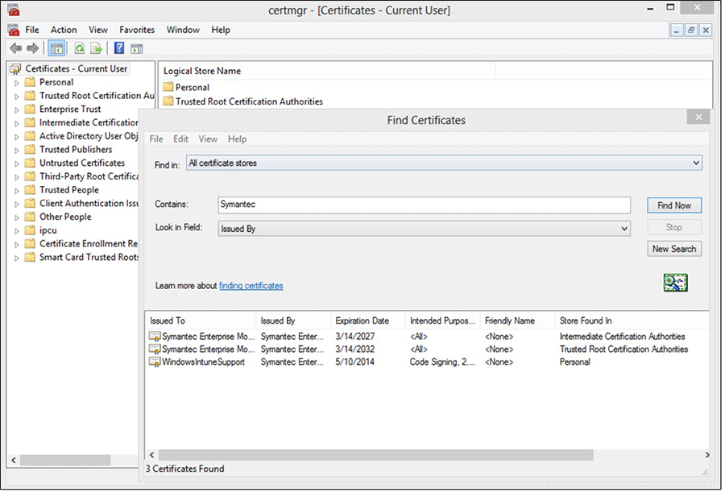
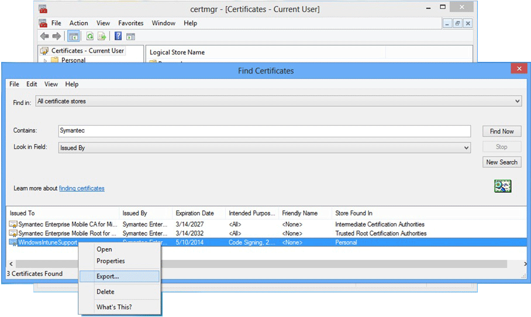

# Set up Windows Phone and Windows 10 Mobile hybrid device management with System Center Configuration Manager and Microsoft Intune
用户必须首先从 Windows Phone 应用商店安装公司门户应用并进行注册，然后才可以使用 [!INCLUDE[cmshort](../LocTest/includes/cmshort_md.md)] 通过 [!INCLUDE[mit_next](../LocTest/includes/mit_next_md.md)]来管理 Windows Phone 8.1 及更高版本的移动设备。  若要注册 Windows Phone 8.0 和将公司应用（包括公司门户应用）部署到 Windows Phone 8.1 和更高版本的设备，必须获取“Symantec 企业移动代码签名证书”。 不能使用自己的证书颁发机构所颁发的证书，因为 Windows Phone 设备仅信任 Symantec 证书。  
  
## 设置 Windows Phone 设备注册  
 若要启用 Windows Phone 移动设备管理，需要启用适用于平台的管理，并指示用户来安装公司门户应用。  
  
### 创建 DNS 别名以进行设备注册  
 通过在设备注册期间自动填充服务器名称，DNS 别名（CNAME 记录类型）可让用户更轻松地注册其设备。 如果不创建 DNS 别名来支持设备注册，则需要提供。若要创建 DNS 别名（CNAME 记录类型），必须在公司的 DNS 记录中配置 CNAME，将发送到公司域名中的 URL 的请求重定向到 Microsoft 的云服务服务器。 *EnterpriseEnrollment.<company domain name\>.com* 重定向到 manage.microsoft.com。 例如，如果贵公司的域为 contoso.com，则必须在 DNS 中创建将 EnterpriseEnrollment.contoso.com 重定向到 EnterpriseEnrollment-s.manage.microsoft.com 的 CNAME。  
  
|类型|主机名|指向|  
|----------|---------------|---------------|  
|CNAME|EnterpriseEnrollment.company_domain.com|EnterpriseEnrollment-s.manage.microsoft.com|  
|CNAME|EnterpriseRegistration.company_domain.com|EnterpriseRegistration.windows.net|  
  
### 启用 Windows Phone 8.1 及更高版本的设备  
 如果你的用户将只注册 Windows Phone 8.1 和更高版本的设备，且你将不会把业务线应用部署到 Windows Phone 设备，则无需 Symantec 证书。 在启用 Windows Phone 注册之后，应指导用户从 Windows Phone 应用商店安装公司门户应用以注册其设备。  
  
 为将进行管理的 Windows Phone 设备完成以下步骤。  
  
##### 若要启用 Windows Phone 8.1 以及更高版本设备的注册  
  
1.  **先决条件** - 在可设置任何平台的注册之前，完成[使用 System Center Configuration Manager 和 Microsoft Intune 的混合移动设备管理 (MDM)](../LocTest/Hybrid-mobile-device-management--MDM--with-System-Center-Configuration-Manager-and-Microsoft-Intune.md) 中的先决条件和过程。  
  
2.  在 [!INCLUDE[cmshort](../LocTest/includes/cmshort_md.md)] 控制台中的“管理”工作区中，转到“云服务” > “Microsoft Intune 订阅”。  
  
    > [!WARNING]  
    >  如果其他 [!INCLUDE[cmshort](../LocTest/includes/cmshort_md.md)] 对话框处于打开状态，请在继续执行此过程之前将其关闭。  
  
3.  在“主页”  选项卡上，单击“配置平台” ，然后单击“Windows Phone” 。  
  
4.  在“常规”选项卡上，选择“Windows Phone 8.1 和 Windows 10 移动版”。 你可以上传 AET .xml 文件数据或 .pfx 文件以支持公司门户的部署，也可以指导用户从 Windows Phone 应用商店中下载公司门户。  
  
     单击" **确定**"。  
  
 设置完成后，需要让用户知道如何注册其设备。 请参阅[用户需要了解的有关设备注册的内容](https://technet.microsoft.com/library/dn948527.aspx)。 此信息适用于 Microsoft Intune 和 Configuration Manager 托管的移动设备。  
  
## 为更高版本的设备启用 Windows Phone 8.0 注册和公司应用部署  
 必须首先获取 Symantec 企业移动代码签名证书，然后才能启用适用于 Windows Phone 8.0 设备的管理或使用 Intune 对业务线应用进行签名和部署。 需要此证书来对不是从 Windows Phone 应用商店安装的 Windows Phone 应用和在 Windows Phone 8.0 设备上安装的应用进行签名。  
  
 下列步骤将帮助你获取所需的 Symantec 证书并对公司门户应用（仅 Windows Phone 8.0）进行签名。 你将需要 Windows Phone 开发人员中心帐户，然后需要购买 Symantec 证书。  
  
 有关 Symantec 证书要求的详细信息，请参阅 [为什么 Windows Phone 管理需要 Symantec 证书？](https://technet.microsoft.com/en-us/library/dn764959.aspx)。  
  
#### 准备注册 Windows Phone 8.0  
  
1.  **先决条件** - 在你可以设置任何平台的注册之前，必须先完成[使用 System Center Configuration Manager 和 Microsoft Intune 的混合移动设备管理 (MDM)](../LocTest/Hybrid-mobile-device-management--MDM--with-System-Center-Configuration-Manager-and-Microsoft-Intune.md) 中列出的先决条件。  
  
2.  **加入 Windows Phone 开发人员中心**   
    登录时使用公司帐户信息加入 [Windows Phone 开发人员中心](http://go.microsoft.com/fwlink/?LinkId=268442) ，以购买你的公司帐户。 在你接收代码签名证书之前，此请求需获得公司主管授权。  
  
3.  **获取公司 Symantec 证书**   
    使用你的 Symantec ID 从 [Symantec 网站](http://go.microsoft.com/fwlink/?LinkId=268441) 购买证书。 购买证书后，在你 Windows Phone 开发人员帐户中指定的公司审批人将收到一封请求审批证书请求的电子邮件。  
  
4.  **导入证书**   
    批准请求后，你将收到一封包含导入证书说明的电子邮件。 按照电子邮件中的说明导入证书。  
  
5.  **验证导入的证书**   
    若要验证是否已正确导入证书，请转到 **“证书”** 管理单元中，右键单击 **“证书”**并选择 **Find “证书”**。 在 **“包含”** 字段中输入“Symantec”，然后单击 **“立即查找”**。 导入的证书应出现在结果中。  
  
       
  
6.  **导出签名证书**   
    验证证书是否存在后，可以导出 .pfx 文件以进行公司门户签名。 选择 **“预期目的”** 为“代码签名”的 Symantec 证书。 右键单击代码签名证书并选择 **“导出”**。  
  
       
  
     在“证书导出向导” 中，选择“是，导出私钥” ，然后单击“下一步” 。 选择“个人信息交换 - PKCS #12 (.PFX)” ，并选择“如果可能，在证书路径中包括所有证书” 。 完成向导。 有关详细信息，请参阅 [How to Export a Certificate with the Private Key（如何导出带私钥的证书）](http://go.microsoft.com/fwlink/?LinkID=203031)。  
  
7.  **下载公司门户**   
    从下载中心下载[适用于 Windows Phone 8.0 的 Intune 公司门户](http://go.microsoft.com/fwlink/?LinkId=268440)。 默认安装位置是 `C:\Program Files (x86)\Microsoft Corporation\Windows Intune Company Portal for Windows Phone`。  
  
8.  **下载 SDK**   
    从下载中心下载 [Windows Phone SDK](http://go.microsoft.com/fwlink/?LinkId=268439)。  
  
9. **对公司门户应用进行代码签名**   
    使用与 SDK 一同下载的 XAPSignTool 应用，用从 Symantec 证书创建的 .pfx 文件对公司门户进行签名。 有关详细信息，请参阅 [How to sign a company app by using XapSignTool（如何使用 XapSignTool 对公司应用进行签名）](http://go.microsoft.com/fwlink/?LinkID=280195)。  
  
10. **创建用于分发的应用程序**   
    创建要部署的应用程序，该应用程序中包含已签名的公司门户应用。 选择“自动检测安装文件中有关此应用程序的信息” 。 在“类型”中，选择“Windows Phone 应用包 (\*.xap) 文件”。 在“位置” 中，浏览到你已复制 ssp.xap 的网络共享。 在“常规信息”  页上，输入将显示在 [!INCLUDE[cmshort](../LocTest/includes/cmshort_md.md)] 控制台中的名称，但请注意，该应用程序在 Windows Phone 的应用列表中将始终显示为公司门户。  
  
11. **启用通过 Configuration Manager 管理**   
     在 Configuration Manager 控制台中的“管理”工作区中，转到“云服务” > “Microsoft Intune 订阅”。  在功能区中，选择“配置平台”，然后单击“Windows Phone”。  
  
     在“常规”选项卡上，选择你将使用的 Windows Phone 平台。 “Windows Phone 8.0”和“Windows Phone 8.1 及 Windows 10 移动版”选项确定了这些平台所需的要求。 例如，选择“Windows Phone 8.0” 时，需要在“公司门户应用”  选项卡上指定公司门户应用。 如果你只选择“Windows Phone 8.1 和 Windows 10 移动版”，则“公司门户应用”选项卡上将禁用这些选项，因为公司门户应用安装与 Windows Phone 8.1 或更高版本设备的设备注册没有关联。  
  
     添加导出到.pfx 文件的证书 (.pfx) 文件。 或者选择应用程序注册令牌，并浏览到文件的位置。 然后，在“公司门户应用”  选项卡上，单击“浏览”  并选择包含已签名公司门户应用的应用程序包。 仅当在“常规”  选项卡上选择了 Windows Phone 8.0 时，此选项才可用。 对于 Windows Phone 8.1 及更高版本，部署包含公司门户应用的应用程序（部署目的为“必需” ）。  
  
12. 在 [!INCLUDE[cmshort](../LocTest/includes/cmshort_md.md)] 控制台中的“管理”工作区中，转到“云服务” > “Microsoft Intune 订阅”。  
  
    > [!WARNING]  
    >  如果其他 [!INCLUDE[cmshort](../LocTest/includes/cmshort_md.md)] 对话框处于打开状态，请在继续执行此过程之前将其关闭。  
  
13. 在“主页”  选项卡上，单击“配置平台” ，然后单击“Windows Phone” 。  
  
14. 在“常规”  选项卡上，选择你将使用的 Windows Phone 平台，然后单击“下一步” 。 “Windows Phone 8.0”  和“Windows Phone 8.1 及更高版本”  选项用于确定这些平台需要的要求。 例如，选择“Windows Phone 8.0” 时，需要在“公司门户应用”  选项卡上指定公司门户应用。 如果你只选择“Windows Phone 8.1 及更高版本” ，则“公司门户应用”  选项卡上将禁用这些选项，因为公司门户应用安装与 Windows Phone 8.1 或更高版本设备的设备注册没有关联。  
  
15. 添加导出到“.pfx 文件” 的证书 (.pfx) 文件。 或者选择“应用程序注册令牌”  ，并浏览到文件的位置。  
  
16. 在“公司门户应用”  选项卡上，单击“浏览”  并选择包含已签名公司门户应用的应用程序包。 仅当在“常规”  选项卡上选择了“Windows Phone 8.0”  时，此选项才可用。 对于 Windows Phone 8.1 及更高版本，部署包含公司门户应用的应用程序（部署目的为“必需” ）。 有关详细信息，请参阅[使用 System Center Configuration Manager 创建 Windows Phone 应用程序](../LocTest/Creating-Windows-Phone-applications-with-System-Center-Configuration-Manager.md)。  
  
17. **分发应用程序**   
    使用分发内容向导将 [!INCLUDE[wit_firstref](../LocTest/includes/wit_firstref_md.md)] 公司门户应用程序分发到 manage.microsoft.com 分发点。  
  
    > [!IMPORTANT]  
    >  请勿为此应用程序创建部署 - 完成 [!INCLUDE[wit_firstref](../LocTest/includes/wit_firstref_md.md)] 订阅向导后，将自动创建部署。  
  
 设置完成后，需要让用户知道如何注册其设备。 请参阅[用户需要了解的有关设备注册的内容](https://technet.microsoft.com/library/dn948527.aspx)。 此信息适用于 Microsoft Intune 和 Configuration Manager 托管的移动设备。