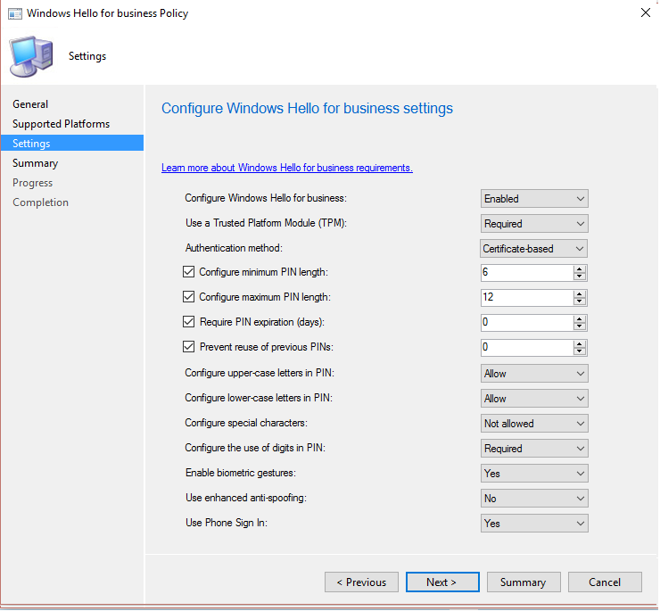

# System Center Configuration Manager 中的 Windows Hello 企业版设置
[!INCLUDE[cm6long](../LocTest/includes/cm6long_md.md)] 使你能够与 Windows Hello 企业版相集成，Windows Hello 企业版是 Windows 10 设备的备用登录方法。 Hello 企业版使用 Active Directory 或 Azure Active Directory 帐户来替代密码、智能卡或虚拟智能卡。  
  
在 Hello 企业版中，可以使用“用户手势”取代密码进行登录。 用户手势可以是简单的 PIN、生物识别身份验证或指纹读取器等外部设备。  
  
 [!INCLUDE[cmshort](../LocTest/includes/cmshort_md.md)] 可通过两种方式与 Windows Hello 企业版相集成：  
  
-   可以使用 [!INCLUDE[cmshort](../LocTest/includes/cmshort_md.md)] 来控制用户能够和不能用于登录的手势  
  
-   可在 Windows Hello 企业版密钥存储提供程序 (KSP) 中存储身份验证证书。 有关详细信息，请参阅 [System Center Configuration Manager 中的证书配置文件](../LocTest/Certificate-profiles-in-System-Center-Configuration-Manager.md)。  
 
<!-- [cmshort](../LocTest/includes/cmshort_md.md)] for domain-joined Windows 10 devices that run the [!INCLUDE[cmshort](../LocTest/includes/cmshort_md.md)] client. This configuration is described in [Configure Windows Hello for Business on domain-joined Windows 10 devices](#BKMK_Dom), below.!-->
<!-- When you are using [!INCLUDE[cmshort](../LocTest/includes/cmshort_md.md)] with [!INCLUDE[mit_first](../LocTest/includes/mit_first_md.md)] (hybrid), you can configure these settings on Windows 10, and Windows 10 Mobile devices, but not on domain-joined devices that run the [!INCLUDE[cmshort](../LocTest/includes/cmshort_md.md)] client.-->    


  
  
## 配置 Windows Hello 企业版设置（混合）  
  
1.  在 [!INCLUDE[cmshort](../LocTest/includes/cmshort_md.md)] 控制台中，单击“管理” 。  
  
2.  在“管理”  工作区中，展开“云服务” ，并单击“Microsoft Intune 订阅” 。  
  
3.  从列表中选择你的 Microsoft Intune 订阅，然后在“主页”选项卡的“订阅”组中，单击“配置平台” > “Windows (MDM)”。  
  
4.  在“Microsoft Intune 订阅属性”对话框的“Windows Hello 企业版”选项卡上，从以下值中选择将影响所有已注册的 Windows 10 和 Windows 10 移动版设备的项：  
  
    -   **禁用已注册设备上的 Windows Hello 企业版**或**启用已注册设备上的 Windows Hello 企业版** - 启用或禁用所有已注册的 Windows 10 和 Windows 10 移动版设备上的 Windows Hello 企业版。  
  
    -   **使用受信任的平台模块 (TPM)** - 受信任的平台模块 (TPM) 芯片提供了一层额外的数据安全保障。 选择下列值之一：  
  
        -   **必须**（默认）- 仅具有可访问 TPM 的设备可预配 Windows Hello 企业版。  
  
        -   **首选** - 首次尝试使用 TPM 的设备。 如果这不可用，他们可以使用软件加密  
  
    -   **要求的最小 PIN 长度** - 指定 Windows Hello 企业版 PIN 所需的最小字符数。 必须使用至少 4 个字符（默认值为 6 个字符）。  
  
    -   **要求的最大 PIN 长度** - 指定 Windows Hello 企业版 PIN 允许的最大字符数。 最多可以使用 127 个字符。  
  
    -   **要求在 PIN 中使用小写字母** - 指定是否必须在 Windows Hello 企业版 PIN 中使用小写字母。 选择：  
  
        -   **允许** - 用户可以在其 PIN 中使用小写字母。  
  
        -   **必须** - 用户必须在其 PIN 中包含至少一个小写字母。  
  
        -   **不允许** （默认）- 用户不得在其 PIN 中使用小写字母。  
  
    -   **要求在 PIN 中使用大写字母** - 指定是否必须在 Windows Hello 企业版 PIN 中使用大写字母。 选择：  
  
        -   **允许** - 用户可以在其 PIN 中使用大写字母。  
  
        -   **必须** - 用户必须在其 PIN 中包含至少一个大写字母。  
  
        -   **不允许** （默认）- 用户不得在其 PIN 中使用大写字母。  
  
    -   **要求含有特殊字符** - 指定 PIN 中使用特殊字符。 选择：  
  
        -   **允许** - 用户可以在其 PIN 中使用特殊字符。  
  
        -   **必须** - 用户必须在其 PIN 中包含至少一个特殊字符。  
  
        -   **不允许** （默认）- 用户必须在其 PIN 中使用特殊字符（这也是不配置此设置时的行为）。  
  
         特殊字符包括：**! " # $ % & ' ( ) \* + , - . / : ; < = > ? @ [ \ ] ^ _ ` { &#124; } ~**。  
  
    -   **需要 PIN 有效期（天）** - 指定必须更改设备 PIN 前的天数。 默认值为 41 天。  
  
    -   **防止重用以前的 PIN** - 使用此设置来限制重用以前使用过的 PIN。 默认设置为不能重用最近使用的 5 个 PIN。  
  
    -   **启用生物识别手势** - 启用如面部识别或指纹等生物识别身份验证作为 Windows Hello 企业版的 PIN 的替代方法。 如果生物识别身份验证失败，则用户仍必须配置工作 PIN。  
  
         如果设置为“启用”，Windows Hello 企业版则允许生物识别身份验证。  如果设置为“禁用”，Windows Hello 企业版将阻止生物识别身份验证（对于所有帐户类型）。  
  
    -   **在可用时，使用增强型反欺骗程序** - 配置是否在支持增强型反欺骗程序的设备上使用该程序。  
  
         如果设置为“已启用” ，则 Windows 将在支持反电子欺骗技术时要求所有用户对面部识别功能使用此技术。  
  
    -   **使用远程 Passport** - 如果此选项设置为“启用”，则用户可以使用远程 Hello 企业版充当台式计算机身份验证的便携伴侣设备。 台式计算机必须加入 Azure Active Directory，并且伴侣设备必须配置 Windows Hello 企业版 PIN。  
  
5.  完成后单击“确定” 。  
  
 
<!-- ##  <a name="BKMK_Dom"></a> Configure Windows Hello for Business on domain-joined Windows 10 devices    -->
<!--You can control Windows Hello for Business settings on domain-joined Windows 10 devices in three ways:  -->

<!--- You can create and deploy a Windows Hello for Business Profile. This is the recommended approach.  -->
<!--- You can use group policy.  -->
<!--- You can use a PowerShell script.  -->

<!--Note that in addition to this configuration, you must also deploy a certificate profile, as described in [Configure a certificate profile](#BKMK_step2).  -->
  
<!--### Recommended approach -  Configure a Windows Hello for Business profile  -->

<!--In the admin console, under **Company Resource Access**, right-click **Windows Hello for Business Profiles** and choose **New** to start the profile wizard. Provide the settings requested by the wizard, review and confirm the settings on the last page, and click **Close**. Here's an example of what your settings might look like:  -->

<!--   -->
   
<!-- ### Configure Windows Hello for Business with Group Policy in Active Directory  -->

<!-- You can use an Active Directory Group Policy to configure your Windows 10 domain-joined devices to provision user Hello for Business credentials when a user logs to Windows:  -->  
   
<!--1.  On a Windows Server  computer, open Server Manager and navigate to **Tools** > **Group Policy Management**.    -->
  
<!--2.  In the **Group Policy Management** dialog box, expand the  domain in which you want to enable Automatic Workplace Join.    -->
  
<!--3.  Right-click **Group Policy Objects**, and then click **New**.  -->  
  
<!--4.  In the **New GPO** dialog box, enter a name for the new Group Policy object, such as **Enable Windows Hello for Business**, and then click **OK**.  -->  
  
<!--5.  In the **Group Policy Objects** node, right-click the object you just created, and then click **Edit**.    -->
  
<!--6.  In the **Group Policy Management Editor** dialog box, navigate to **Computer Configuration** > **Policies** > **Administrative Templates** > **Windows Components** > **Windows Hello for Business**.    -->
  
<!--7.  Right-click **Enable Windows Hello for Business** and then click **Edit**.  -->  
  
<!--8.  Select **Enabled**, click **Apply**, and then click **OK**.  -->  
  
<!-- You can now link the Group Policy object you just created to a location of your choice. For example:    -->
  
<!---   A specific Organizational Unit (OU) in AD where Windows 10 domain-joined computers will be located.    -->
  
<!---   A specific security group containing Windows 10 domain-joined computers that will be automatically registered with Azure AD.  -->  
  
<!--#### Configure Windows Hello for Business by deploying a PowerShell script with Configuration Manager    -->
<!--You can create and deploy the following PowerShell script by using [!INCLUDE[cmshort](../LocTest/includes/cmshort_md.md)] application management.  -->  
  
<!--```    -->
<!--powershell.exe -ExecutionPolicy Bypass -NoLogo -NoProfile -Command "& {New-ItemProperty "HKLM:\Software\Policies\Microsoft\PassportForWork" -Name "Enabled" -Value 1 -PropertyType "DWord" -Force}"   --> 
<!--```  -->  
  
<!-- For more information about [!INCLUDE[cmshort](../LocTest/includes/cmshort_md.md)] application management, see [Deploy and manage applications with System Center Configuration Manager](../LocTest/Deploy-and-manage-applications-with-System-Center-Configuration-Manager.md).  -->
  
## <a name="BKMK_step2"></a>配置证书配置文件以便在 Configuration Manager 中注册 Windows Hello 企业版注册证书  
 如果你想使用基于 Windows Hello 企业版证书的登录（或 Microsoft Hello），请进行以下配置：  
  
-   [!INCLUDE[cmshort](../LocTest/includes/cmshort_md.md)] 证书配置文件。  
  
-   在证书配置文件中，选择使用智能卡登录 EKU 的模板。  
  
 有关详细信息，请参阅 [System Center Configuration Manager 中的证书配置文件](../LocTest/Certificate-profiles-in-System-Center-Configuration-Manager.md)。  
  
### 另请参阅  
 [使用 System Center Configuration Manager 保护数据和站点基础架构](../LocTest/Protect-data-and-site-infrastructure-with-System-Center-Configuration-Manager.md)
 
 [使用 Microsoft Passport 管理身份验证](https://technet.microsoft.com/itpro/windows/keep-secure/manage-identity-verification-using-microsoft-passport)。  
 